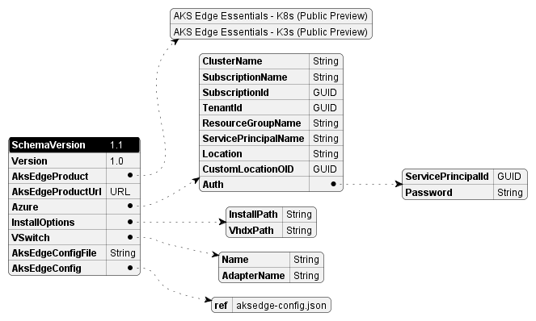
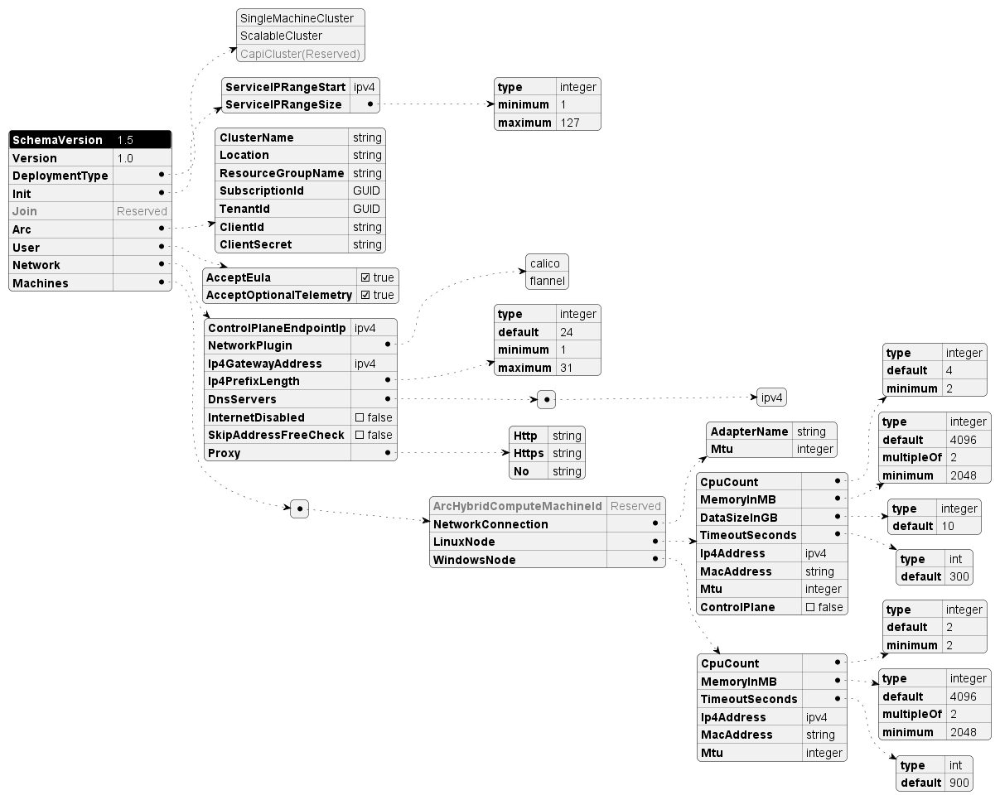

# AksEdgeDeploy (aide)

AksEdgeDeploy module enables you to automate the AKS edge installation, deployment and provisioning easily with a simple json specification.

The `Start-AideWorkflow` function in the modole does the following:

- Installs the required version of the AKS edge
- Validate the json parameters
- Creates the required network switch
- Deploys the AKS edge virtual machine with the json parameters
- Verifies the AKS edge virtual machine is up and running

## Usage

1. Populate the *aide-userconfig.json* with the desired parameters and values. Below is the minimal configuration example for a single machine deployment with 4GB memory.

    ```json
    {
        "SchemaVersion": "1.0",
        "Version": "1.0",
        "AksEdgeProduct" : "AKS Edge Essentials - K8s (Public Preview)",
        "AksEdgeConfig": {
            "DeployOptions": {
                "SingleMachineCluster": true
            },
            "EndUser": {
                "AcceptEula": true,
                "AcceptOptionalTelemetry" : true
            },
            "LinuxVm": {
                "CpuCount": 4,
                "MemoryInMB": 4096,
                "DataSizeinGB": 20
            }
        },
        "Azure": {
            "SubscriptionName":"Visual Studio Enterprise",
            "SubscriptionId": "",
            "TenantId":"",
            "ResourceGroupName": "aksedgepreview-rg",
            "ServicePrincipalName" : "aksedge-sp",
            "Location" : "EastUS"
        }
    }
    ```

2. Call `Start-AideWorkflow` with the json file as input. This will perform the deployment.

```powershell
Start-AideWorkflow -jsonFile 'C:\MyConfigs\aide-userconfig.json'
```

## AksEdgeDeploy Config Json

<details><summary>AksEdgeDeploy Config Schema</summary>
Find below the details of the supported parameters in the json file.
<details><summary>SchemaVersion</summary>

| | |
| --------- | -------- |
|Required | Mandatory |
|Type / Values | 1.1 |
|Description | Fixed value, schema version. Reserved|
</details>
<details><summary>Version</summary>

| | |
| --------- | -------- |
|Required | Mandatory |
|Type / Values | 1.0 |
|Description | Fixed value, json instance version. Reserved|
</details>
<details><summary>AksEdgeProduct</summary>

| | |
| --------- | -------- |
|Required | Mandatory |
|Type / Values | AKS Edge Essentials - K8s (Public Preview) <br> AKS Edge Essentials - K3s (Public Preview)|
|Description | Desired product K8s or K3s|
</details>
<details><summary>AksEdgeProductUrl</summary>

| | |
| --------- | -------- |
|Required | Optional |
|Type / Values | URL|
|Description |URL to download the MSI|
</details>
<details><summary>AksEdgeConfig</summary>

| | |
| --------- | -------- |
|Required | Optional |
|Type / Values | Json object|
|Description |Embedded json object for AKS Edge Configuration|
</details>
<details><summary>AksEdgeConfigFile</summary>

| | |
| --------- | -------- |
|Required | Optional |
|Type / Values | String |
|Description |File path to the AKS Edge Configuration json. Either `AksEdgeConfig` or `AksEdgeConfigFile` needs to be specified.|
</details>
<details><summary>Azure</summary>

| Parameter | Required | Type / Values | Comments |
| --------- | -------- |---------------- | -------- |
| ClusterName | Optional | String | Name of the cluster for Arc connection. Default is hostname-distribution (abc-k8s or def-k3s)|
| SubscriptionName | Mandatory | GUID | SubscriptionName  |
| SubscriptionId | Optional | GUID | SubscriptionId  |
| TenantId | Optional | GUID | TenantId  |
| ResourceGroupName | Mandatory | String | ResourceGroupName  |
| ServicePrincipalName | Mandatory | String | ServicePrincipalName  |
| Location | Mandatory | String | Location  |
| `Auth`.ServicePrincipalId |Optional | String | Specify service principal appID to use|
| `Auth`.Password |Optional| String | Specify the password (clear) |
</details>
</details>
<details><summary>AksEdgeDeploy Config Visual</summary>



</details>

## AksEdge Config Json

<details><summary>AksEdge Config Schema</summary>
The below table provides the schema for the AksEdge Deployment Configuration json.
<details><summary>DeployOptions</summary>

| Parameter | Required | Type / Values | Comments |
| --------- | -------- | --------------- | -------- |
| SingleMachineCluster | Mandatory | Boolean | SingleMachine with internal switch  created when true |
| NodeType | Mandatory | [Linux &#124; Windows &#124; LinuxAndWindows] | Windows only is supported in Full Kubernetes deployment |
| NetworkPlugin | Optional | [calico &#124; flannel] | flannel is default |
| Headless | Optional | Boolean | Headless mode |
| TimeoutSeconds|Optional|Int| This specifies the maximum wait for a kubernetes node to reach a specified state (eg. Ready) |
| JoinCluster|Optional| Boolean | the new deployment will join an existing remote cluster. SingleMachineCluster should be false when this is set to true |
| ControlPlane|Optional|Boolean| This parameter indicates that the Linux node of this deployment will join an existing cluster as a node that runs the control plane |
| ClusterJoinToken|Optional|String| The cluster join token used for joining an existing cluster |
| DiscoveryTokenHash|Optional|String| The discovery token hash used for joining an existing cluster |
</details>
<details><summary>EndUser</summary>

| Parameter | Required | Type / Values | Comments |
| --------- | -------- | --------------- | -------- |
| AcceptEula | Mandatory | Yes |  Accept Eula |
| AcceptOptionalTelemetry | Optional | Yes |  Accept optional telemetry to be sent |
</details>
<details><summary>LinuxVm</summary>

| Parameter | Required | Type / Values | Comments |
| --------- | -------- | --------------- | -------- |
| CpuCount | Optional |2 | CpuCount|
| MemoryInMB | Optional |2| MemoryInMB|
| DataSizeInGB | Optional | 2-2000| Size in GB|
| Ip4Address | Optional | IPv4 |  Static IP Address for the Linux Node VM |
</details>

<details><summary>WindowsVm</summary>

| Parameter | Required | Type / Values | Comments |
| --------- | -------- | --------------- | -------- |
| CpuCount | Optional |2 | CpuCount|
| MemoryInMB | Optional |2| MemoryInMB|
| Ip4Address | Optional | IPv4 |  Static IP Address for the Windows Node VM |
</details>
<details><summary>Network</summary>

| Parameter | Required | Type / Values | Comments |
| --------- | -------- |---------------- | -------- |
| `VSwitch`.Type | Optional | External |Only **External** switch supported currently. SingleMachine cluster uses Internal switch always and does not required to be specified.|
| `VSwitch`.Name | Optional | String | Switch name to use |
| `VSwitch`.AdapterName | Mandatory | String | NetAdapterName for VSwitch, mandatory for Full kubernetes deployment |
| ControlPlaneEndpointIp | Optional | IPv4 |  This parameter allows defining a specific IP address to be used as the control plane endpoint IP for the deployment. If not specified, the endpoint will equal the local Linux node's IP address when creating a new cluster |
| ServiceIPRangeSize | Optional | IPv4 |  Required for SingleMachine deployment |
| ServiceIPRangeStart | Optional | IPv4 |  Required for Scalable deployment |
| ServiceIPRangeEnd | Optional | IPv4 |  Required for Scalable deployment |
| Ip4GatewayAddress | Optional | IPv4 | Static Gateway IP Address |
| Ip4PrefixLength | Optional | [1..32] | IP PrefixLength |
| `Proxy`.Http | Optional | String | HttpProxy link |
| `Proxy`.Https | Optional | String | HttpsProxy link |
| `Proxy`.No | Optional | String | No-proxy specification |
| DnsServers | Optional | [IPv4] | Array of valid dns servers for VM |
</details>
</details>

<details><summary>AksEdge Config Visual</summary>


</details>

## AKS Edge Essentials Arc Connection

The following functions enables you to install and use `Arc enabled Servers` and `Arc enabled Kubernetes` easily on a windows IoT device.

### Usage

1. Populate the *aide-userconfig.json* with the desired values.
2. Run the script [`AksEdgeAzureSetup.ps1`](../../scripts/AksEdgeAzureSetup/AksEdgeAzureSetup.ps1) in the `tools\scripts\AksEdgeAzureSetup` directory to setup your Azure subscription, create the resource group, setup the required extensions and also create the service principal with minimal privileges(`Azure Connected Machine Onboarding`,`Kubernetes Cluster - Azure Arc Onboarding`). You will need to login for Azure CLI interactively for the first time to create the service principal. This step is required to be run only once per subscription.

   ```powershell
   # prompts for interactive login for serviceprincipal creation with minimal privileges
    cd .\scripts\AksEdgeAzureSetup
   .\AksEdgeAzureSetup.ps1 .\aide-userconfig.json
   ```

    If you require to create the service principal with `Contributor` role at the resource group level, you can add the `-spContributorRole` switch.

    >[!Note] You will require the Contributor role if you need to disconnect your kubernetes cluster using `Disconnect-AideArcKubernetes`.
    To, reset an already existing service principal, use `-spCredReset`. Reset should be used cautiously.

   ```powershell
   # creates service principal with Contributor role at resource group level
   .\AksEdgeAzureSetup.ps1 .\aide-userconfig.json -spContributorRole
   ```

   ```powershell
   # resets the existing service principal
   .\AksEdgeAzureSetup.ps1 .\aide-userconfig.json -spCredReset
   ```

    ```powershell
   # you can test the creds with 
   .\AksEdgeAzureSetup-Test.ps1 .\aide-userconfig.json
   ```

3. Import the AksEdgeDeploy module and set the user config.
4. Run `Initialize-AideArc` to install the required software (Azure CLI) and validates that Azure setup is good.
5. `Connect-AideArcServer` to connect your machine to Arc-enabled server.
6. After installing AKS edge or any kuberenetes cluster in your Linux VM, verify with `kubectl get nodes` and then call `Connect-AideArcKubernetes`

```powershell
# installs AzCLI 
Initialize-AideArc
# Connects the Win IoT machine to Arc-enabled server
Connect-AideArcServer
# Prereq: install AKS edge and deploy cluster
# test the cluster is good
kubectl get nodes
# Connect the cluster to Arc-enabled Kubernetes
Connect-AideArcKubernetes
```

alternatively, you can use `Connect-AideArc` that enables both Arc-enabled server and Arc-enabled kubernetes.

```powershell
# installs AzCLI 
Initialize-AideArc
# connect both Arc-enabled server and kubernetes
Connect-AideArc
```

## Supported Functions

| Functions |
|:------------ |
|`Start-AideWorkflow -jsonFile (or) -jsonString`|
| Main funtion that validates the user config, installs AksEdge, creates switch, deploys and provisions VM |
|`Connect-AideArc`|
| Connects Arc-enabled server and Arc-enabled kubernetes|
|`Disconnect-AideArc`|
| Disconnects Arc-enabled server and Arc-enabled kubernetes|
</details>
<details><summary>User Config Functions</summary>

| |
|:------------ |
|`Get-AideUserConfig`|
| Returns the json object that is cached |
|`Set-AideUserConfig -jsonFile (or) -jsonString`|
| Sets the user config and reads the config into the cache |
|`Read-AideUserConfig`|
|Reads the json file into the cache |
|`Test-AideUserConfig`|
| Tests the User Config json for parameter correctness |
</details>
<details><summary>VM Switch Functions</summary>

| |
|:------------ |
|`New-AideVmSwitch`|
| Creates an new VM switch based on user config. |
|`Test-AideVmSwitch -Create`|
| Tests if the VM switch is present, `Create` flag invokes New-AideVmSwitch if switch is not present |
|`Remove-AideVmSwitch`|
| Removes the VM switch if present. Also removes the Nat if created (for internal switch) |

</details>
<details><summary>Deployment functions</summary>

| |
|:------------ |
|`Invoke-AideDeployment`|
| Validates the deployment parameters in user json and deploys AKS edge VM|
|`Test-AideDeployment`|
| Tests if the AKS edge VM is deployed (present) |
|`Remove-AideDeployment`|
| Removes the existing deployment |
|`Test-AideLinuxVmRun`|
| Tests if the AKS edge VM is running in the machine |
</details>
<details><summary>AksEdge MSI Install functions</summary>

| |
|:------------ |
|`Get-AideMsiVersion`|
| Returns the installed product name and version (PSCustom object with Name,Version) or Null if none found|
|`Install-AideMsi`|
| Installs the requested product from the aksedgeProductUrl if specified, otherwise it installs the latest (default)|
|`Test-AideMsiInstall -Install`|
| Tests if AKS edge is installed and `Install` switch is specified, it installs when not found|
|`Remove-AideMsi`|
| Removes the installed AKS edge product|
|`Get-AideHostPcInfo`|
| Gets the PC information such as OS version etc|
</details>
<details><summary>Azure Arc Install functions</summary>

| |
|:------------ |
|`Install-AideAzCli` |
| Installs Azure CLI |
|`Initialize-AideArc`|
| Main funtion that checks and installs required software, validates if the Auth parameters are good for Azure login  |
| Disconnects Arc-enabled server and Arc-enabled kubernetes|
|`Enter-AideArcSession`|
| Logs in to Azure using the service principal credentials|
|`Exit-AideArcSession`|
| Logs out from the Azure CLI session|
</details>
<details><summary>Azure Arc-enabled Server Functions</summary>

| |
|:------------ |
|`Install-AideArcServer`|
| Installs Azure Connected Machine Agent |
|`Test-AideArcServer`|
| Tests ConnectedMachine Agent status (returns true if connected) |
|`Connect-AideArcServer`|
| Connects the machine to Arc-enabled server |
|`Disconnect-AideArcServer`|
| Removes the Arc-enabled server connection |
|`Get-AideArcServerInfo`|
| Returns the HIMDS info (name,subscriptionid,resourcegroupname and location) from Connected machine agent |
|`Get-AideArcServerSMI`|
| Retrieves the system assigned managed identity for Arc-enabled server|
</details>
<details><summary>Azure Arc-enabled Kubernetes Functions</summary>

| |
|:------------ |
|`Test-AideArcKubernetes`|
| Tests if the kubernetes cluster is connected to Arc |
|`Connect-AideArcKubernetes`|
| Connects the kubernetes cluster to Arc using the default kubeconfig files |
|`Disconnect-AideArcKubernetes`|
| Deletes the kubernetes cluster resource in Arc |
|`Get-AideArcKubernetesServiceToken`|
| Retrieves the service token for admin-user in the kubernetes cluster |
|`Get-AideArcClusterName`|
| Retrieves the cluster name used for Arc connection |
</details>
