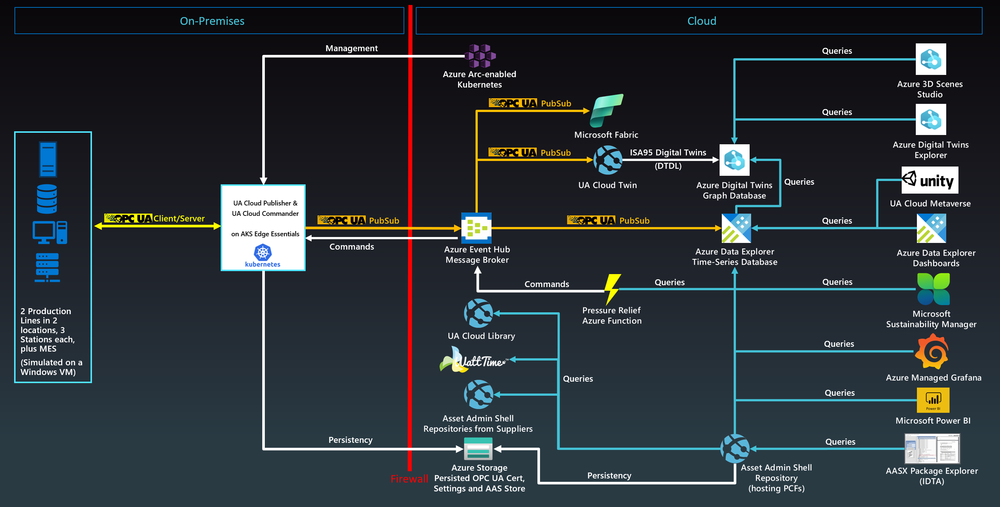
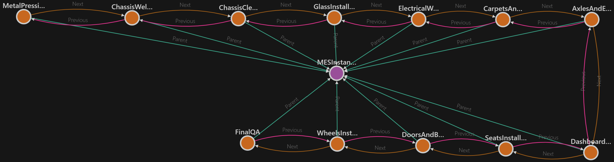
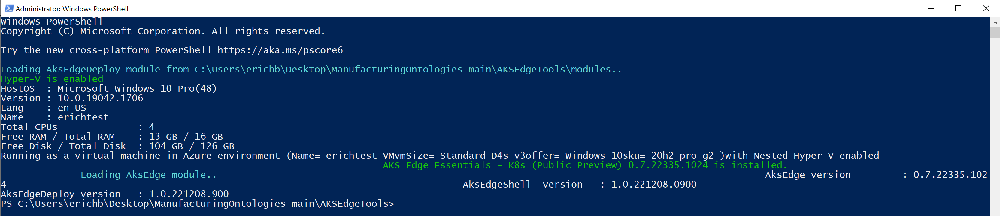
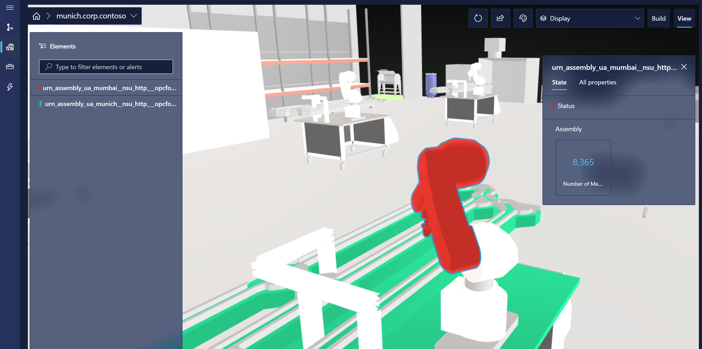

# Manufacturing Ontologies

## Introduction

An ontology defines the language used to describe a system. In the manufacturing domain, these systems can represent a factory or plant but also enterprise applications or supply chains. There are several established ontologies in the manufacturing domain. Most of them have long been standardized. In this repository, we have focused on two of these ontologies, namely ISA95 to describe a factory ontology and IEC 63278 Asset Administration Shell to describe a manufacturing supply chain. Furthermore, we have included a factory simulation and an end-to-end solution architecture for you to try out the ontologies, leveraging IEC 62541 OPC UA and the Microsoft Azure Cloud.

### Digital Twin Definition Language

The ontologies defined in this repository are described by leveraging the Digital Twin Definition Language (DTDL), which is specified [here](https://github.com/Azure/opendigitaltwins-dtdl/blob/master/DTDL/v2/dtdlv2.md).

### International Society of Automation 95 (ISA95)

ISA95 is one of the ontologies leveraged by this solution. It is a standard and described [here](https://en.wikipedia.org/wiki/ANSI/ISA-95).

### IEC 63278 Asset Administration Shell (AAS)

The IEC 63278 Asset Administration Shell is another ontology leveraged by this solution. This standard is described [here](https://www.plattform-i40.de/IP/Redaktion/EN/Standardartikel/specification-administrationshell.html) and tools to convert from Asset Administration Shell models to DTDL are provided in this repository [here](https://github.com/digitaltwinconsortium/ManufacturingOntologies/tree/main/Tools/AssetAdminShell). Furthermore, the reference solution provided in this repository also contains an AAS Repository service from the Digital Twin Consortium's repository here(https://github.com/digitaltwinconsortium/AAS-Repository).

### IEC 62541 Open Platform Communications Unified Architecture (OPC UA)

This solution leverages IEC 62541 Open Platform Communications Unified Architecture (OPC UA) for all Operational Technology (OT) data. This standard is described [here](https://opcfoundation.org). 

## Reference Solution Architecture

This repository contains a reference solution leveraging the ontologies described above with an implementation on Microsoft Azure. Other implementations can be easily added by implementing the open interface IDigitalTwin within the UA Cloud Twin application.

Here are the components involved in this solution:

| Component | Description |
| --- | --- |
| Industrial Assets | A set of simulated OPC-UA enabled production lines hosted in Docker containers |
| [UA Cloud Publisher](https://github.com/barnstee/ua-cloudpublisher) | This edge application converts OPC UA Client/Server requests into OPC UA PubSub cloud messages. It's hosted in a Docker container. |
| [UA Cloud Commander](https://github.com/barnstee/ua-cloudcommander) | This edge application converts messages sent to an MQTT or Kafka broker (possibly in the cloud) into OPC UA Client/Server requests for a connected OPC UA server. It's hosted in a Docker container. |
| [AKS Edge Essentials](https://learn.microsoft.com/en-us/azure/aks/hybrid/aks-edge-overview) | This Kubernetes implementation (both K3S and K8S are supported) runs at the Edge and provides single- and multi-node Kubernetes clusters for a fault-tolerant Edge configuration on embedded or PC-class hardware, like an industrial gateway. |
| [Azure Event Hubs](https://learn.microsoft.com/en-us/azure/event-hubs/event-hubs-about) | The cloud message broker that receives OPC UA PubSub messages from edge gateways and stores them until they're retrieved by subscribers like the UA Cloud Twin. Separately, it's also used to forward data history events emitted from the Azure Digital Twins instance to the Azure Data Explorer instance. |
| [UA Cloud Twin](https://github.com/digitaltwinconsortium/UA-CloudTwin) | This cloud application converts OPC UA PubSub cloud messages into digital twin updates. It also creates digital twins automatically by processing the cloud messages. Twins are instantiated from models in ISA95-compatible DTDL ontology. It's hosted in a Docker container. |
| [Azure Digital Twins](https://learn.microsoft.com/en-us/azure/digital-twins/overview) | The platform that enables the creation of a digital representation of real-world assets, places, business processes, and people. |
| [Azure Data Explorer](https://learn.microsoft.com/en-us/azure/synapse-analytics/data-explorer/data-explorer-overview) | The time series database and front-end dashboard service for advanced cloud analytics, including built-in anomaly detection and predictions. |
| [Pressure Relief Azure Function](https://github.com/digitaltwinconsortium/ManufacturingOntologies/tree/main/Tools/FactorySimulation/PressureReliefFunction) | This Azure Function queries the Azure Data Explorer for a specific data value (the pressure in one of the simulated production line machines) and calls UA Cloud Commander via Azure Event Hubs when a certain threshold is reached (4000 mbar). UA Cloud Commander then calls the OpenPressureReliefValve method on the machine via OPC UA. |
| [Azure Arc](https://learn.microsoft.com/en-us/azure/azure-arc/kubernetes/overview) | This cloud service is used to manage the on-premises Kubernetes cluster at the edge. New workloads can be deployed via Flux. |

:exclamation: In a real-world deployment, someting as critical as opening a pressure relief valve would of course be done on-premises and this is just a simple example of how to achieve the digital feedback loop.

Here are the data flow steps:

1. The UA Cloud Publisher reads OPC UA data from each simulated factory, and forwards it via OPC UA PubSub to Azure Event Hubs. 
1. The UA Cloud Twin reads and processes the OPC UA data from Azure Event Hubs, and forwards it to an Azure Digital Twins instance. 
    1. The UA Cloud Twin also automatically creates digital twins in Azure Digital Twins in response, mapping each OPC UA element (publishers, servers, namespaces, and nodes) to a separate digital twin.
    1. The UA Cloud Twin also automatically updates the state of digital twins based on the data changes in their corresponding OPC UA nodes. 
1. Updates to digital twins in Azure Digital Twins are automatically historized to an Azure Data Explorer cluster via the data history feature. Data history generates time series data, which can be used for analytics, such as [OEE (Overall Equipment Effectiveness)](https://www.oee.com) calculation and predictive maintenance scenarios.

## UA Cloud Twin

The simulation makes use of the UA Cloud Twin also available from the Digital Twin Consortium [here](https://github.com/digitaltwinconsortium/UA-CloudTwin). It automatically detects OPC UA assets from the OPC UA telemetry messages sent to the cloud and registers ISA95-compatible digital twins in Azure Digital Twins service for you.

#### Mapping OPC UA Servers to the ISA95 Hierarchy Model

UA Cloud Twin takes the combination of the OPC UA Application URI and the OPC UA Namespace URIs discovered in the OPC UA telemetry stream (specifically, in the OPC UA PubSub metadata messages) and creates OPC UA Nodeset digital twin instances (inherited from the ISA95 Work Center digital twin model) for each one. UA Cloud Publisher sends the OPC UA PubSub metadata messages to a seperate broker topic to make sure all metadata can be read by UA Cloud Twin before the processing of the telemetry messags starts.

#### Mapping OPC UA PubSub Publishers to the ISA95 Hierarchy Model

UA Cloud Twin takes the OPC UA Publisher ID and creates ISA95 Area digital twin instances (derived from the digital twin model of the same name) for each one.

#### Mapping OPC UA PubSub Datasets to the ISA95 Hierarchy Model

UA Cloud Twin takes each OPC UA Field discovered in the received Dataset metadata and creates an OPC UA Node digital twin instance (inherited from the ISA95 Work Unit digital twin model) for each.

## A Cloud-based OPC UA Certificate Store and Persisted Storage

When running OPC UA applications, their OPC UA configuration files, keys and certificates must be persisted. While Kubernetes has the ability to persist these files in volumes, a safer place for them is the cloud, especially on single-node clusters where the volume would be lost when the node fails. This is why the OPC UA applications used in this solution (i.e. the UA Cloud Publisher, the MES and the simulated machines/production line stations) store their configuration files, keys and certificates in the cloud. This also has the advantage of providing a single location for mutually trusted certificates for all OPC UA applications.

## Production Line Simulation

The solution leverages a production line simulation made up of several Stations, leveraging an OPC UA information model, as well as a simple Manufacturing Execution System (MES). Both the Stations and the MES are containerized for easy deployment.

### Default Simulation Configuration

The simulation is configured to include 2 production lines. The default configuration is depicted below:

| Production Line | Ideal Cycle Time (in seconds) |
| --- | --- |
| Munich | 6 |
| Seattle |	10 |

### OPC UA Node IDs of Station OPC UA Server

The following OPC UA Node IDs are used in the Station OPC UA Server for telemetry to the cloud
* i=379 - manufactured product serial number
* i=385 - number of manufactured products
* i=391 - number of discarded products
* i=398 - running time
* i=399 - faulty time
* i=400 - status (0=station ready to do work, 1=work in progress, 2=work done and good part manufactured, 3=work done and scrap manufactured, 4=station in fault state)
* i=406 - energy consumption
* i=412 - ideal cycle time
* i=418 - actual cycle time
* i=434 - pressure

## Installation of Production Line Simulation and Cloud Services

Clicking on the button below will **deploy** all required resources (on Microsoft Azure):

You can also **visualize** the resources that will get deployed by clicking the button below:

Once the deployment completes, follow these steps to setup a single-node Edge Kubernetes cluster and finish configuring the simulation:

1. Connect to the deployed Windows VM with an RDP (remote desktop) connection. You can download the RDP file in the [Azure portal](https://portal.azure.com) page for the VM, under the **Connect** options. Sign in using the credentials you provided during deployment.
1. From the VM, download and install [Azure Kubernetes Services Edge Essentials](https://aka.ms/aks-edge/k8s-msi).
1. Download and install the [Azure CLI](https://aka.ms/installazurecliwindows).
1. Download this repository from [here](https://github.com/digitaltwinconsortium/ManufacturingOntologies/archive/refs/heads/main.zip) and extract to a directory of your choice.
1. From a **Windows command prompt**, navigate to the `./AKSEdgeTools` directory of the extracted repository and run `AksEdgePrompt`. On first run after some config steps, this will reboot the VM. Log in again and run `AksEdgePrompt` from a command prompt again. This will open a PowerShell window:

    

1. Run `New-AksEdgeDeployment -JsonConfigFilePath .\aksedge-config.json` from the PowerShell window and select the amount of diagnostic data you want to send to Microsoft at the prompt.

Once the script is finished, your Kubernetes installation is complete and you can start deploying workloads.

Note: To get logs from all your Kubernetes workloads and services at any time, simply run `Get-AksEdgeLogs` from the Powershell window that can be opened via `AksEdgePrompt`.

## Running the Production Line Simulation

On the deployed VM, navigate to the `./Tools/FactorySimulation/OnPremAssets` directory of the extracted repository downloaded ealier and run the **StartSimulation** command from a **Windows command prompt** by supplying the following parameters:

Syntax:

    StartSimulation <EventHubsCS> <StorageAccountCS> <AzureSubscriptionName>

Parameters:

| Parameter | Description |
| --- | --- |
| EventHubCS | Copy the Event Hubs namespace connection string as described [here](https://learn.microsoft.com/en-us/azure/event-hubs/event-hubs-get-connection-string"). |
| StorageAccountCS | In the Azure Portal, navigate to the Storage Account created by this solution. Select "Access keys" from the left-hand navigation menu. Then, copy the connection string for key1. |
| AzureSubscriptionName | In Azure Portal, browse your Subscriptions and copy the name of the subscription used in this solution. |
    
Example:

    StartSimulation Endpoint=sb://ontologies.servicebus.windows.net/;SharedAccessKeyName=RootManageSharedAccessKey;SharedAccessKey=abcdefgh= DefaultEndpointsProtocol=https;AccountName=ontologiesstorage;AccountKey=abcdefgh==;EndpointSuffix=core.windows.net MyAzureSubscription

Note: On first run, a tool to copy files to Azure Storage needs to be installed. When prompted, simply press enter to proceed with the installation.

Note: In this solution, the OPC UA application certificate store for UA Cloud Publisher, as well as the simulated production line's MES and individual machines' store, is located in the cloud in the deployed Azure Storage account.

## View Digital Twins in Azure Digital Twins Explorer

You can use [Azure Digital Twins Explorer](https://learn.microsoft.com/en-us/azure/digital-twins/concepts-azure-digital-twins-explorer) to monitor twin property updates and add more relationships to the digital twins that are created. For example, you might want to add *Next* and *Previous* relationships between machines on each production line to add more context to your solution.

To access Azure Digital Twins Explorer, first make sure you have the [Azure Digital Twins Data Owner role](https://learn.microsoft.com/en-us/azure/digital-twins/how-to-set-up-instance-portal#assign-the-role-using-azure-identity-management-iam) on your Azure Digital Twins instance. Then [open the explorer](https://learn.microsoft.com/en-us/azure/digital-twins/quickstart-azure-digital-twins-explorer#open-instance-in-azure-digital-twins-explorer).

## Condition Monitoring, Calculating OEE, Detecting Anomalies and Making Predictions in Azure Data Explorer

You can also visit the [Azure Data Explorer documentation](https://learn.microsoft.com/en-us/azure/synapse-analytics/data-explorer/data-explorer-overview) to learn how to create no-code dashboards for condition monitoring, yield or maintenance predictions, or anomaly detection. There are a number of sample queries in the `./Tools/FactorySimulation/ADXQueries` folder in this repository to get you started, plus we have provided a sample dashboard in the same folder that you can deploy by following the steps outlined [here](https://learn.microsoft.com/en-us/azure/data-explorer/azure-data-explorer-dashboards#to-create-new-dashboard-from-a-file).

Note: In each of the queries and in the provided ADX dashboard configuration file, replace `<ADTHistoryTableName>` with the name of your ADT history table. This name can be copied from the Azure Data Explorer page of this solutions's deployed instance in the Azure Portal under Query -> the deployed ADX cluster instance name -> the deployed ADX database instance name -> the ADT history table name.

## Using 3D Scenes Studio

If you want to add a 3D viewer to the simulation, you can follow the steps to configure the 3D Scenes Studio outlined [here](https://learn.microsoft.com/en-us/azure/digital-twins/how-to-use-3d-scenes-studio) and map the 3D robot model from [here](https://cardboardresources.blob.core.windows.net/public/RobotArms.glb) to the digital twins automatically generated by the UA Cloud Twin:

## Enabling the Digital Feedback Loop with UA Cloud Commander and the Pressure Relief Azure Function

If you want to test a "digital feedback loop", i.e. triggering a command on one of the OPC UA servers in the simulation from the cloud, based on a time-series reaching a certain threshold (the simulated pressure), deploy the PressureRelief Azure Function in your Azure subscription and create an application registration for your ADX instance as described [here](https://docs.microsoft.com/en-us/azure/data-explorer/provision-azure-ad-app). You also need to define the following environment variables in the Azure portal for the Function:

* ADX_INSTANCE_URL - the endpoint of your ADX cluster, e.g. https://ontologies.eastus2.kusto.windows.net/
* ADX_DB_NAME - the name of your ADX database
* ADX_TABLE_NAME - the name of your ADX table
* AAD_TENANT_ID - the GUID of your AAD tenant of your Azure subscription
* APPLICATION_KEY - the secret you created during pressure relief function app registration
* APPLICATION_ID - the GUID assigned to the pressure relief function during app registration
* BROKERNAME - the name of your event hubs namespace, e.g. ontologies-eventhubs.servicebus.windows.net
* USERNAME - set to "$ConnectionString"
* PASSWORD - the primary key connection string of your event hubs namespace
* TOPIC - set to "commander.command"
* RESPONSE_TOPIC - set to "commander.response"
* UA_SERVER_ENDPOINT - set to "opc.tcp://assembly.seattle/" to open the pressure relief valve of the Seattle assembly machine
* UA_SERVER_METHOD_ID - set to "ns=2;i=435"
* UA_SERVER_OBJECT_ID - set to "ns=2;i=424"
* UA_SERVER_APPLICATION_NAME - set to "assembly"
* UA_SERVER_DNS_NAME - set to "seattle"

## Onboarding the Kubernetes Instance for Management via Azure Arc

1. On your virtual machine, From a command prompt, navigate to the `AKSEdgeTools` directory and run `AksEdgePrompt`.
1. Run `notepad aide-userconfig.json` and provide the following information:

    | Attribute | Description |
    | --- | --- |
    | SubscriptionName	| The name of your Azure subscription. You can find this on the Azure portal. |
    | SubscriptionId | Your subscription ID. In the Azure portal, click on the subscription you're using and copy/paste the subscription ID. |
    | TenantId | Your tenant ID. In the Azure portal, click on Azure Active Directory and copy/paste the tenant ID. |
    | ResourceGroupName | The name of the Azure resource group which was deployed for this solution. |
    | ServicePrincipalName | The name of the Azure Service Principal to use as credentials. AKS uses this service principal to connect your cluster to Arc. Set this to the same name as your ResourceGroupName for simplicity. |

1. Save the file and run `.\scripts\AksEdgeAzureSetup\AksEdgeAzureSetup.ps1 .\aide-userconfig.json -spContributorRole` from the PowerShell window.
1. Run `Read-AideUserConfig` from the PowerShell window.
1. Run `Initialize-AideArc` from the Powershell window.
1. Run `Connect-AideArcKubernetes` from the Powershell window.

You can now manage your Kubernetes cluster from the cloud via the newly deployed Azure Arc instance. In the Azure Portal, browse to the Azure Arc instance and select Workloads. The required service token can be retrieved via `Get-AideArcKubernetesServiceToken` from the `AksEdgePrompt` on your virtual machine.

## Replacing the Production Line Simulation with a Real Production Line

Once you are ready to connect your own production line, simply delete the VM from the Azure Portal.

1. Edit the UA-CloudPublisher.yaml file provided in the `Deployment` folder of this repository, replacing [yourstorageaccountname] with the name of your Azure Storage Account and [key] with the key1 of your Azure Storage Account. You can access this information from the Azure Portal on your deployed Azure Storage Account under Access keys.
1. Run UA Cloud Publisher with the following command. The PC needs Kubernetes support and Internet access (via port 9093) and needs to be able to connect to your OPC UA-enabled machines in your production line:

        kubectl apply -f UA-CloudPublisher.yaml

1. Open a browser on the Edge PC and navigate to http://localhost:[kubernetesPortForYourPublisherService]. You are now connected to the UA Cloud Publisher's interactive UI. Select the Configuration menu item and enter the following information, replacing [myeventhubsnamespace] with the name of your Event Hubs namespace and replacing [myeventhubsnamespaceprimarykeyconnectionstring] with the primary key connection string of your Event Hubs namespace. The primary key connection string can be read in the Azure Portal under your Event Hubs' "share access policy" -> "RootManagedSharedAccessKey". Then click Update:
  
        BrokerClientName: "UACloudPublisher"  
        BrokerUrl: "[myeventhubsnamespace].servicebus.windows.net"
        BrokerPort: 9093  
        BrokerUsername: "$ConnectionString"  
        BrokerPassword: "[myeventhubsnamespaceprimarykeyconnectionstring]"  
        BrokerMessageTopic: "data"
        BrokerMetadataTopic: "metadata"  
        SendUAMetadata: true  
        MetadataSendInterval: 43200  
        BrokerCommandTopic: ""
        BrokerResponseTopic: ""  
        BrokerMessageSize: 262144  
        CreateBrokerSASToken: false  
        UseTLS: false  
        PublisherName: "UACloudPublisher"  
        InternalQueueCapacity: 1000  
        DefaultSendIntervalSeconds: 1  
        DiagnosticsLoggingInterval: 30  
        DefaultOpcSamplingInterval: 500  
        DefaultOpcPublishingInterval: 1000  
        UAStackTraceMask: 645  
        ReversiblePubSubEncoding: false  
        AutoLoadPersistedNodes: true  

1. Configure the OPC UA data nodes from your machines (or connectivity adapter software). To do so, select the OPC UA Server Connect menu item, enter the OPC UA server IP address and port and click Connect. You can now browse the OPC UA Server you want to send telemetry data from. If you have found the OPC UA node you want, right click it and select publish.

Note: UA Cloud Publisher stores its configuration and log files in the cloud within the Azure Storage Account deployed in this solution.

Note: You can check what is currently being published by selecting the Publishes Nodes tab. You can also see diagnostics information from UA Cloud Publisher on the Diagnostics tab.

## License

This work is licensed under a <a rel="license" href="http://creativecommons.org/licenses/by/4.0/">Creative Commons Attribution 4.0 International License</a>.
