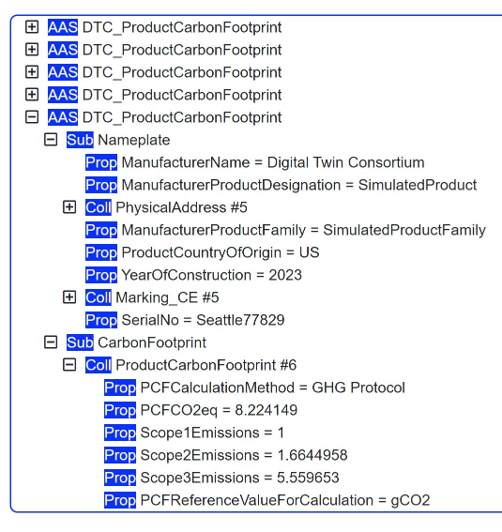
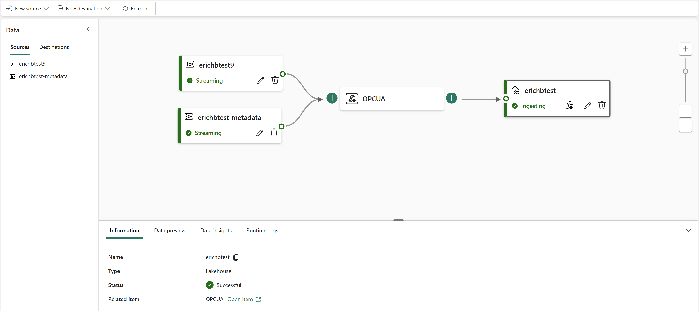
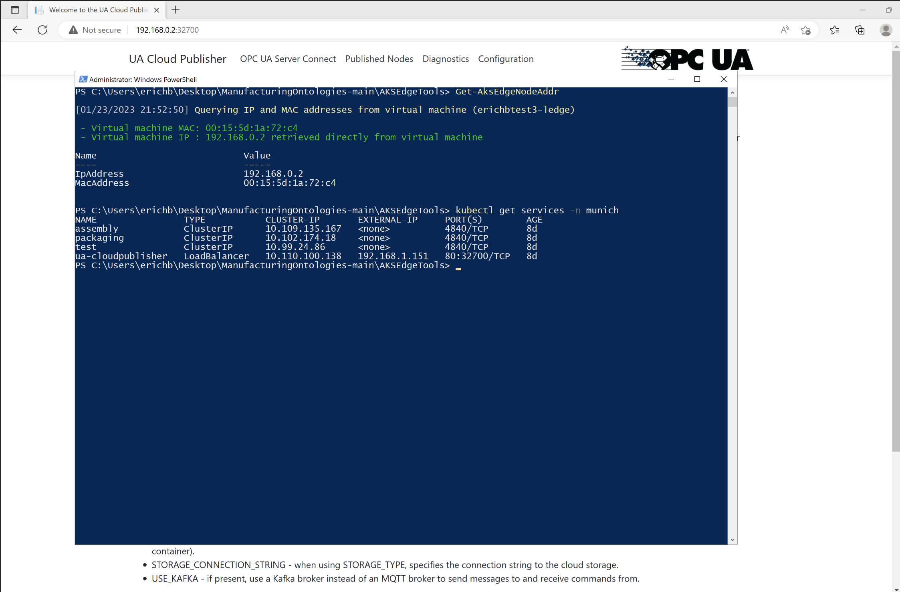

# Manufacturing Ontologies

## Introduction

An ontology defines the language used to describe a system. In the manufacturing domain, these systems can represent a factory or plant but also enterprise applications or supply chains. There are several established ontologies in the manufacturing domain. Most of them have long been standardized. In this repository, we have focused on two of these ontologies, namely ISA95 to describe a factory ontology and IEC 63278 Asset Administration Shell to describe a manufacturing supply chain. Furthermore, we have included a factory simulation and an end-to-end solution architecture for you to try out the ontologies, leveraging IEC 62541 OPC UA and the Microsoft Azure Cloud.

### Digital Twin Definition Language

The ontologies defined in this repository are described by leveraging the Digital Twin Definition Language (DTDL), which is specified [here](https://github.com/Azure/opendigitaltwins-dtdl/blob/master/DTDL/v2/dtdlv2.md).

### International Society of Automation 95 (ISA95/IEC 62264)

ISA95 / IEC 62264 is one of the ontologies leveraged by this solution. It is a standard and described [here](https://en.wikipedia.org/wiki/ANSI/ISA-95) and [here](https://en.wikipedia.org/wiki/IEC_62264).

### IEC 63278 Asset Administration Shell (AAS)

The IEC 63278 Asset Administration Shell (AAS) enables vendor-neutral, platform-independent data exchange along a manufacturing supply chain and leveraged by this solution. The standard is described [here](https://www.plattform-i40.de/IP/Redaktion/EN/Standardartikel/specification-administrationshell.html). A script to convert from Asset Administration Shell models to DTDL to manually upload AAS models to Azure Digital Twins service is provided [here](https://github.com/digitaltwinconsortium/ManufacturingOntologies/tree/main/Tools/AssetAdminShell). Furthermore, the reference solution provided in this repository also contains an AAS Repository service from the Digital Twin Consortium's reference implementation [here](https://github.com/digitaltwinconsortium/AAS-Repository). This service makes the Product Carbon Footprint (PCF) of the simulated products built by the simulated production lines available to customers. Please see below about how to enable this service.

### IEC 62541 Open Platform Communications Unified Architecture (OPC UA)

This solution leverages IEC 62541 Open Platform Communications Unified Architecture (OPC UA) for all Operational Technology (OT) data. This standard is described [here](https://opcfoundation.org). 

## Reference Solution Architecture

This repository contains a reference solution leveraging the ontologies described above with an implementation on Microsoft Azure. Other implementations can be easily added by implementing the open interface IDigitalTwin within the UA Cloud Twin application.

Here are the components involved in this solution:

| Component | Description |
| --- | --- |
| Industrial Assets | A set of simulated OPC-UA enabled production lines hosted in Docker containers |
| [UA Cloud Publisher](https://github.com/barnstee/ua-cloudpublisher) | This edge application converts OPC UA Client/Server requests into OPC UA PubSub cloud messages. It's hosted in a Docker container. |
| [UA Cloud Commander](https://github.com/opcfoundation/ua-cloudcommander) | This edge application converts messages sent to an MQTT or Kafka broker (possibly in the cloud) into OPC UA Client/Server requests for a connected OPC UA server. It's hosted in a Docker container. |
| [AKS Edge Essentials](https://learn.microsoft.com/en-us/azure/aks/hybrid/aks-edge-overview) | This Kubernetes implementation (both K3S and K8S are supported) runs at the Edge and provides single- and multi-node Kubernetes clusters for a fault-tolerant Edge configuration on embedded or PC-class hardware, like an industrial gateway. |
| [Azure Event Hubs](https://learn.microsoft.com/en-us/azure/event-hubs/event-hubs-about) | The cloud message broker that receives OPC UA PubSub messages from edge gateways and stores them until they're retrieved by subscribers like the UA Cloud Twin. |
| [UA Cloud Twin](https://github.com/digitaltwinconsortium/UA-CloudTwin) | This cloud application converts OPC UA PubSub cloud messages into digital twin updates. It also creates digital twins automatically by processing the cloud messages. Twins are instantiated from models in ISA95-compatible DTDL ontology. It's hosted in a Docker container. |
| [Azure Digital Twins](https://learn.microsoft.com/en-us/azure/digital-twins/overview) | The platform that enables the creation of a digital representation of real-world assets, places, business processes, and people. |
| [Azure Data Explorer](https://learn.microsoft.com/en-us/azure/synapse-analytics/data-explorer/data-explorer-overview) | The time series database and front-end dashboard service for advanced cloud analytics, including built-in anomaly detection and predictions. |
| [UA Cloud Action](https://github.com/digitaltwinconsortium/UA-CloudAction) | This cloud application queries the Azure Data Explorer for a specific data value (the pressure in one of the simulated production line machines) and calls UA Cloud Commander via Azure Event Hubs when a certain threshold is reached (4000 mbar). UA Cloud Commander then calls the OpenPressureReliefValve method on the machine via OPC UA. |
| [Azure Arc](https://learn.microsoft.com/en-us/azure/azure-arc/kubernetes/overview) | This cloud service is used to manage the on-premises Kubernetes cluster at the edge. New workloads can be deployed via Flux. |
| [Azure Storage](https://learn.microsoft.com/en-us/azure/storage/common/storage-introduction) | This cloud service is used to manage the OPC UA certificate store and settings of the Edge Kubernetes workloads. |
| [Azure 3D Scenes Studio](https://github.com/digitaltwinconsortium/ManufacturingOntologies#using-3d-scenes-studio) | This cloud app allows the creation of 3D immersive viewers for your manufacturing data. |
| [Azure Digital Twins Explorer](https://github.com/digitaltwinconsortium/ManufacturingOntologies#view-digital-twins-in-azure-digital-twins-explorer) | This cloud app allows you to view your digital twins in an interactive UI. |
| [Azure Data Explorer Dashboards](https://github.com/digitaltwinconsortium/ManufacturingOntologies#condition-monitoring-calculating-oee-detecting-anomalies-and-making-predictions-in-azure-data-explorer) | This cloud app allows the creation of 2D viewers for your manufacturing data. |
| [Asset Admin Shell Repository](https://github.com/digitaltwinconsortium/AAS-Repository) | This REST web service and UI allows you to host Asset Administration Shells containing product information for your customers in a machine-readable format. |
| [AASX Package Explorer](https://github.com/admin-shell-io/aasx-package-explorer) | This app allows you to view and modify Asset Administration Shells on your PC. |
| [UA Cloud Metaverse](https://github.com/OPCFoundation/UA-CloudMetaverse) | This Industrial Metaverse app allows you to view digital twins of our manufacturing assets via Augmented Reality or Virtual Reality headsets. Work in progress! |
| [Microsoft Sustainability Manager](https://github.com/digitaltwinconsortium/ManufacturingOntologies/blob/main/Tools/MicrosoftSustainabilityManager/configuremsm.md) | Microsoft Sustainability Manager is an extensible solution that unifies data intelligence and provides comprehensive, integrated, and automated sustainability management for organizations at any stage of their sustainability journey. It automates manual processes, enabling organizations to more efficiently record, report, and reduce their emissions. |
| [Azure Managed Grafana](https://learn.microsoft.com/en-us/azure/managed-grafana/overview) | Azure Managed Grafana is a data visualization platform built on top of the Grafana software by Grafana Labs. It's built as a fully managed Azure service operated and supported by Microsoft. |
| [UA Cloud Library](https://github.com/OPCFoundation/UA-CloudLibrary) | The UA Cloud Library is an online store of OPC UA Information Models, hosted by the OPC Foundation [here](https://uacloudlibrary.opcfoundation.org/). |
| [WattTime Service](https://www.watttime.org/api-documentation/#introduction) | The WattTime service can be used to get the carbon intensity for a unit of electrical energy consumed during a manufacturing process, specific to a particular geographic coordinate passed into the service. |
| [Microsoft Power BI](https://learn.microsoft.com/en-us/power-bi/fundamentals/power-bi-overview) | Microsoft Power BI is a collection of software services, apps, and connectors that work together to turn your unrelated sources of data into coherent, visually immersive, and interactive insights. |
| [Microsoft Fabric](https://learn.microsoft.com/en-us/fabric/get-started/microsoft-fabric-overview) | Microsoft Fabric is an all-in-one analytics solution for enterprises that covers everything from data movement to data science, Analytics, and business intelligence. It offers a comprehensive suite of services, including data lake, data engineering, and data integration, all in one place. |

:exclamation: In a real-world deployment, something as critical as opening a pressure relief valve would of course be done on-premises and this is just a simple example of how to achieve the digital feedback loop.

Here are the data flow steps:

1. The UA Cloud Publisher reads OPC UA data from each simulated factory, and forwards it via OPC UA PubSub to Azure Event Hubs. 
1. The UA Cloud Twin reads and processes the OPC UA data from Azure Event Hubs, and forwards it to an Azure Digital Twins instance. 
1. The UA Cloud Twin automatically creates digital twins in Azure Digital Twins in response, mapping each OPC UA element (publishers, servers, namespaces) to a separate digital twin.
1. Azure Data Explorer also reads and processes the OPC UA data from Azure Event Hubs and generates time series data, which can be used for analytics, such as [OEE (Overall Equipment Effectiveness)](https://www.oee.com) calculation and predictive maintenance scenarios.

## UA Cloud Twin

The simulation makes use of the UA Cloud Twin also available from the Digital Twin Consortium [here](https://github.com/digitaltwinconsortium/UA-CloudTwin). It automatically detects OPC UA assets from the OPC UA telemetry messages sent to the cloud and registers ISA95-compatible digital twins in Azure Digital Twins service for you.

#### Mapping OPC UA Servers to the ISA95 Hierarchy Model

UA Cloud Twin takes the combination of the OPC UA Application URI and the OPC UA Namespace URIs discovered in the OPC UA telemetry stream (specifically, in the OPC UA PubSub metadata messages) and creates OPC UA Nodeset digital twin instances (inherited from the ISA95 Work Center digital twin model) for each one. UA Cloud Publisher sends the OPC UA PubSub metadata messages to a separate broker topic to make sure all metadata can be read by UA Cloud Twin before the processing of the telemetry messages starts.

#### Mapping OPC UA PubSub Publishers to the ISA95 Hierarchy Model

UA Cloud Twin takes the OPC UA Publisher ID and creates ISA95 Area digital twin instances (derived from the digital twin model of the same name) for each one.

## A Cloud-based OPC UA Certificate Store and Persisted Storage

When running OPC UA applications, their OPC UA configuration files, keys and certificates must be persisted. While Kubernetes has the ability to persist these files in volumes, a safer place for them is the cloud, especially on single-node clusters where the volume would be lost when the node fails. This is why the OPC UA applications used in this solution (i.e. the UA Cloud Publisher, the MES and the simulated machines/production line stations) store their configuration files, keys and certificates in the cloud. This also has the advantage of providing a single location for mutually trusted certificates for all OPC UA applications.

## UA Cloud Library

The Asset Admin Shell Repository used in this reference solution reads OPC UA Information Models referenced by products described within Asset Admin Shells from the UA Cloud Library automatically. You can also read OPC UA Information Models directly from Azure Data Explorer (also used in this reference solution) and import the OPC UA nodes defined in the OPC UA Information Model into a table for lookup of additional metadata within queries. Simply run the following Azure Data Explorer query:

        let uri='https://uacloudlibrary.opcfoundation.org/infomodel/download/<insert information model identifier from cloud library here>';
        let headers=dynamic({'accept':'text/plain'});
        let options=dynamic({'Authorization':'Basic <insert your cloud library credentials hash here>'});
        evaluate http_request(uri, headers, options)
        | project title = tostring(ResponseBody.['title']), contributor = tostring(ResponseBody.contributor.name), nodeset = parse_xml(tostring(ResponseBody.nodeset.nodesetXml))
        | mv-expand UAVariable=nodeset.UANodeSet.UAVariable
        | project-away nodeset
        | extend NodeId = UAVariable.['@NodeId'], DisplayName = tostring(UAVariable.DisplayName.['#text']), BrowseName = tostring(UAVariable.['@BrowseName']), DataType = tostring(UAVariable.['@DataType'])
        | project-away UAVariable
        | take 100

## Production Line Simulation

The solution leverages a production line simulation made up of several Stations, leveraging an OPC UA information model, as well as a simple Manufacturing Execution System (MES). Both the Stations and the MES are containerized for easy deployment.

### Default Simulation Configuration

The simulation is configured to include 2 production lines. The default configuration is depicted below:

| Production Line | Ideal Cycle Time (in seconds) |
| --- | --- |
| Munich | 6 |
| Seattle |	10 |

| Shift Name | Start | End |
| --- | --- | --- |
| Morning | 07:00 | 14:00 |
| Afternoon | 15:00 | 22:00 |
| Night | 23:00 | 06:00 |

### OPC UA Node IDs of Station OPC UA Server

The following OPC UA Node IDs are used in the Station OPC UA Server for telemetry to the cloud
* i=379 - manufactured product serial number
* i=385 - number of manufactured products
* i=391 - number of discarded products
* i=398 - running time
* i=399 - faulty time
* i=400 - status (0=station ready to do work, 1=work in progress, 2=work done and good part manufactured, 3=work done and scrap manufactured, 4=station in fault state)
* i=406 - energy consumption
* i=412 - ideal cycle time
* i=418 - actual cycle time
* i=434 - pressure

## Calculating the Product Carbon Footprint (PCF)

One of the most popular use cases for the Asset Administration Shell (AAS) is to make the Product Carbon Footprint (PCF) of manufactured products available to customers of those products. In fact, the AAS will most likely become the underlying technology in the upcoming [Digital Product Passport (DPP)](https://circulareconomy.europa.eu/platform/en/news-and-events/all-events/eu-digital-product-passport-learning-frontrunners) initiative from the European Union. To calculate the PCF, all three scopes (1, 2 & 3) of emissions need to be taken into account. See [here](https://github.com/digitaltwinconsortium/ManufacturingOntologies#enabling-the-product-carbon-footprint-calculation-pcf-in-the-asset-admin-shell-aas-repository) about how to enable the AAS to calculate and provide the PCF to external consumers via a standardized REST interface and see [here](https://github.com/digitaltwinconsortium/ManufacturingOntologies/blob/main/Tools/MicrosoftSustainabilityManager/configuremsm.md) about how to enable the Microsoft Sustainability Manager (MSM) to calculate the PCF.

### Scope 1 Emissions

These emissions come from all sources the manufacturer uses to burn fossil fuels, either during production (for example when the manufacturer has a natural gas-powered production process) or before (for example picking up parts by truck) or afterwards (for example the cars of sales people or the delivery trucks with the produced products). They are relatively easy to calculate as the emissions from fossil fuel-powered engines are a well-understood quantity. This reference solution simply adds a fixed value for scope 1 emissions to the total product carbon footprint.

### Scope 2 Emissions

These emissions come from the electricity used during production. If the manufacturer uses a 100% renewable energy provider, the scope 2 emissions are zero. However, most manufacturers have long-term contracts with energy providers and need to ask their energy provider for the carbon intensity per KWh of energy delivered. If this data is not available, an average for the electricity grid region the manufacturing site is in should be used. This data is available through services like [WattTime](https://www.watttime.org) and this is what this reference solution uses via the built-in [Asset Admin Shell Repository](https://github.com/digitaltwinconsortium/AAS-Repository) also available open-source from the Digital Twin Consortium. Please see below on how to configure this part of the reference solution after deployment. The PCF calculation first checks if a new product was successfully produced by the production line, retrieves the produced product's serial number, followed by the energy consumption of each machine of the production line while the new product was produced by the machine and then applies the carbon intensity to the sum of all machines' energy consumption.

### Scope 3 Emissions

These emissions come from the parts and raw materials used within the product being manufactured as well as from using the product by the end customer (and getting it into the customer's hands in the first place!) and are the hardest to calculate simply due to a lack of data from the worldwide suppliers manufacturer uses today. Unfortunately, scope 3 emissions make up almost 90% of the emissions in manufacturing. However, this is where the AAS can help create a standardized interface and data model to provide and retrieve scope 3 emissions. This reference solution does just that by making an AAS available for each manufactured product built by the simulated production line and also reads PCF data from another AAS simulating a manufacturing supply chain.

## Digital Feedback Loop with UA Cloud Commander and UA Cloud Action

This reference implementation implements a "digital feedback loop", i.e. triggering a command on one of the OPC UA servers in the simulation from the cloud, based on a time-series reaching a certain threshold (the simulated pressure). You can see the pressure of the assembly machine in the Seattle production line being released on regular intervals in the Azure Data Explorer dashboard.

## Installation of Production Line Simulation and Cloud Services

Clicking on the button below will **deploy** all required resources (on Microsoft Azure):

Note: During deployment, you must provide a password for a VM used to host the production line simulation and for UA Cloud Twin. The password must have 3 of the following: 1 lower case character, 1 upper case character, 1 number, and 1 special character. The password must be between 12 and 72 characters long.

You can also **visualize** the resources that will get deployed by clicking the button below:

Note: To save cost, the deployment deploys just a single Windows 11 Enterprise VM for both the production line simulation and the base OS for the Azure Kubernetes Services Edge Essentials instance. In production scenarios, the production line simulation is obviously not required and for the base OS for the Azure Kubernetes Services Edge Essentials instance, we recommend Windows IoT Enterprise Long Term Servicing Channel (LTSC).

Once the deployment completes, follow these steps to setup a single-node Edge Kubernetes cluster and finish configuring the simulation:

1. Connect to the deployed Windows VM with an RDP (remote desktop) connection. You can download the RDP file in the [Azure portal](https://portal.azure.com) page for the VM, under the **Connect** options. Sign in using the credentials you provided during deployment.
1. From the VM, download and install [Azure Kubernetes Services Edge Essentials](https://aka.ms/aks-edge/k8s-msi).
1. Download and install the [Azure CLI](https://aka.ms/installazurecliwindows).
1. Download this repository from [here](https://github.com/digitaltwinconsortium/ManufacturingOntologies/archive/refs/heads/main.zip) and extract to a directory of your choice.
1. From a **Windows command prompt**, navigate to the `./AKSEdgeTools` directory of the extracted repository and run `AksEdgePrompt`. On first run after some config steps, this will reboot the VM. Log in again and run `AksEdgePrompt` from a command prompt again. This will open a PowerShell window:

    

1. Run `New-AksEdgeDeployment -JsonConfigFilePath .\aksedge-config.json` from the PowerShell window.

Once the script is finished, your Kubernetes installation is complete and you can start deploying workloads.

Note: To get logs from all your Kubernetes workloads and services at any time, simply run `Get-AksEdgeLogs` from the Powershell window that can be opened via `AksEdgePrompt`.

## Running the Production Line Simulation

On the deployed VM, navigate to the `./Tools/FactorySimulation` directory of the extracted repository downloaded ealier and run the **StartSimulation** command from a **Windows command prompt** by supplying the following parameters:

Syntax:

    StartSimulation <EventHubsCS> <StorageAccountCS> <AzureSubscriptionID>

Parameters:

| Parameter | Description |
| --- | --- |
| EventHubCS | Copy the Event Hubs namespace connection string as described [here](https://learn.microsoft.com/en-us/azure/event-hubs/event-hubs-get-connection-string). |
| StorageAccountCS | In the Azure Portal, navigate to the Storage Account created by this solution. Select "Access keys" from the left-hand navigation menu. Then, copy the connection string for key1. |
| AzureSubscriptionID | In Azure Portal, browse your Subscriptions and copy the ID of the subscription used in this solution. |
    
Example:

    StartSimulation Endpoint=sb://ontologies.servicebus.windows.net/;SharedAccessKeyName=RootManageSharedAccessKey;SharedAccessKey=abcdefgh= DefaultEndpointsProtocol=https;AccountName=ontologiesstorage;AccountKey=abcdefgh==;EndpointSuffix=core.windows.net 9dd2eft0-3dad-4aeb-85d8-c3adssd8127a

Note: If you have access to several Azure subscriptions, it is worth first logging into the Azure Portal from the VM through the web browser. You can also switch Active Directory tenants through the Azure Portal UI (in the top-right-hand corner), to make sure you are logged in to the tenant used during deployment. Once logged in, simply leave the browser window open. This will ensure that the StartSimulation script can more easily connect to the right subscription.

Note: On first run, a tool to copy files to Azure Storage needs to be installed. When prompted, simply press enter to proceed with the installation.

Note: In this solution, the OPC UA application certificate store for UA Cloud Publisher, as well as the simulated production line's MES and individual machines' store, is located in the cloud in the deployed Azure Storage account.

## View Digital Twins in Azure Digital Twins Explorer

You can use [Azure Digital Twins Explorer](https://learn.microsoft.com/en-us/azure/digital-twins/concepts-azure-digital-twins-explorer) to monitor twin property updates and add more relationships to the digital twins that are created. For example, you might want to add *Next* and *Previous* relationships between machines on each production line to add more context to your solution.

To access Azure Digital Twins Explorer, first make sure you have the [Azure Digital Twins Data Owner role](https://learn.microsoft.com/en-us/azure/digital-twins/how-to-set-up-instance-portal#assign-the-role-using-azure-identity-management-iam) on your Azure Digital Twins instance. Then [open the explorer](https://learn.microsoft.com/en-us/azure/digital-twins/quickstart-azure-digital-twins-explorer#open-instance-in-azure-digital-twins-explorer).

## Generate a Digital Twins Graph with the ADT Generator Tool

You can use [ADT Generator](https://github.com/digitaltwinconsortium/ManufacturingOntologies/blob/main/Tools/ADTGenerator/Readme.md) to simplify the creation of a digital twin graph, based on the ISA95 models provided in this repository.

To use the ADT Generator tool, first make sure you have Microsoft Excel installed, you have the production line simluation running and you have the [Azure Digital Twins Data Owner role](https://learn.microsoft.com/en-us/azure/digital-twins/how-to-set-up-instance-portal#assign-the-role-using-azure-identity-management-iam) on your Azure Digital Twins instance.

## Condition Monitoring, Calculating OEE, Detecting Anomalies and Making Predictions in Azure Data Explorer

You can also visit the [Azure Data Explorer documentation](https://learn.microsoft.com/en-us/azure/synapse-analytics/data-explorer/data-explorer-overview) to learn how to create no-code dashboards for condition monitoring, yield or maintenance predictions, or anomaly detection. We have provided a sample dashboard in the `./Tools/FactorySimulation/ADXQueries` folder for you to deploy to the ADX Dashboard by following the steps outlined [here](https://learn.microsoft.com/en-us/azure/data-explorer/azure-data-explorer-dashboards#to-create-new-dashboard-from-a-file). After import, you need to update the dashboard's data source by specifying the HTTPS endpoint of your ADX server cluster instance in the format `https://ADXInstanceName.AzureRegion.kusto.windows.net/` in the top-right-hand corner of the dashboard.

Note: To calculate the OEE for the entire production lines, you need to set your ADT instance URL in the `CalculateOEEForLine` query. Also, you need to have the [Azure Digital Twins Data Owner role](https://learn.microsoft.com/en-us/azure/digital-twins/how-to-set-up-instance-portal#assign-the-role-using-azure-identity-management-iam) on your Azure Digital Twins instance.

Note: If you want to display the OEE for a specific shift, select `Custom Time Range` in the `Time Range` drop down in the top-left hand corner of the ADX Dashboard and enter the date and time from start to end of the shift you are interested in. 

## Using Azure Managed Grafana Service

You can also leverage Grafana to create a dashboard on Azure for this reference solution. Please see the documentation [here](https://github.com/digitaltwinconsortium/ManufacturingOntologies/blob/main/Tools/GrafanaDashboard/configuregrafana.md).

## Using 3D Scenes Studio

If you want to add a 3D viewer to the simulation, you can follow the steps to configure the 3D Scenes Studio outlined [here](https://learn.microsoft.com/en-us/azure/digital-twins/how-to-use-3d-scenes-studio) and map the 3D robot model from [here](https://cardboardresources.blob.core.windows.net/public/RobotArms.glb) to the digital twins automatically generated by the UA Cloud Twin:

## Onboarding the Kubernetes Instance for Management via Azure Arc

1. On your virtual machine, From a **Windows PowerShell window**, navigate to the `AKSEdgeTools` directory.
1. Run `notepad aide-userconfig.json` and provide the following information:

    | Attribute | Description |
    | --- | --- |
    | SubscriptionName	| The name of your Azure subscription. You can find this in the Azure portal under Subscriptions. |
    | SubscriptionId | Your subscription ID. In the Azure portal, click on the subscription you're using and copy/paste the subscription ID. |
    | TenantId | Your tenant ID. In the Azure portal, click on Azure Active Directory and copy/paste the tenant ID. |
    | ResourceGroupName | The name of the Azure resource group which was deployed for this solution. |
    | ServicePrincipalName | The name of the Azure Service Principal to use as credentials. AKS uses this service principal to connect your cluster to Arc. Set this to the same name as your ResourceGroupName for simplicity. |

1. Save the file, and run `SetupArc` from the PowerShell window.

You can now manage your Kubernetes cluster from the cloud via the newly deployed Azure Arc instance. In the Azure Portal, browse to the Azure Arc instance and select Workloads. The required service token can be retrieved via `Get-AideArcKubernetesServiceToken` from the `AksEdgePrompt` on your virtual machine.

## Enabling the Product Carbon Footprint Calculation (PCF) in the Asset Admin Shell (AAS) Repository

The Asset Admin Shell (AAS) Repository is automatically configured during deployment of the reference solution, but for the Product Carbon Footprint (PCF) calculation, a WattTime service account needs to be provided. Please refer to [the WattTime API documentation](https://www.watttime.org/api-documentation/#best-practices-for-api-usage) on how to register for an account. Once your account has been activated, provide your username and password in the settings of the AAS Repo website from the Azure Portal via YourDeploymentName-AAS-Repo -> Configuration -> Application settings.

## Connecting the Reference Solution to Microsoft Power BI

To see how you can use the Azure Data Explorer time-series data as a data source for Power BI, see [here](https://learn.microsoft.com/en-us/azure/data-explorer/power-bi-data-connector). Once the data connection is made, you can create Power BI reports and dashboards by following the instructions [here](https://learn.microsoft.com/en-us/power-bi/create-reports/).

## Connecting the Reference Solution to Microsoft Fabric

1. You can start a Microsoft Fabric trial from [here](https://learn.microsoft.com/en-us/fabric/get-started/fabric-trial).
1. Once you are logged into Microsoft Fabric, open the Azure Portal, navigate to your Azure Event Hubs Namespace and create a new `fabic` consumer group in both the data and metadata Event Hubs. Also, take a note of the primary key associated with your `RootManageSharedAccessKey` Shared Access Policy of your Event Hubs Namespace. You will need it later in Microsoft Fabric as username and password to connect to the Event Hubs.
1. Follow the steps described [here](https://learn.microsoft.com/en-us/fabric/real-time-analytics/event-streams/overview) to create Event Streams for both the OPC UA PubSub telemetry data as well as for the OPC UA PubSub metadata, directly from the solution's Event Hubs.

## Connecting the Reference Solution to On-Premises SAP Systems

Microsoft provides a connector to on-premsises SAP systems in combination with an on-premises data gateway for Azure Logic Apps. Azure Logic Apps is a no-code Azure service to orchistrate workflows that can trigger actions in e.g. Azure Digital Twins. To connect your on-premises SAP systems to Azure Logic Apps, follow these steps:

1. Deploy an instace of Azure Logic Apps in the same region you picked during deployment of this reference solution. Select the comsumption-based version.
1. Install the on-premsises data gateway by following the instructions [here](https://learn.microsoft.com/en-us/azure/logic-apps/logic-apps-gateway-install).
1. Setup the SAP connector for Azure Logic Apps by following the instructions [here](https://learn.microsoft.com/en-us/azure/logic-apps/logic-apps-using-sap-connector?tabs=consumption).
1. Create a workflow in your Azure Logic Apps instance by following the instructions [here](https://learn.microsoft.com/en-us/azure/logic-apps/sap-create-example-scenario-workflows?tabs=consumption).
1. To connect your Azure Logic Apps workflow to the Azure Digital Twins instance deployed in this reference solution, see [here](https://learn.microsoft.com/en-us/azure/digital-twins/how-to-use-power-platform-logic-apps-connector).

## Replacing the Production Line Simulation with a Real Production Line

Once you are ready to connect your own production line, simply delete the VM from the Azure Portal.

1. Edit the UA-CloudPublisher.yaml file provided in the `Deployment` folder of this repository, replacing [yourstorageaccountname] with the name of your Azure Storage Account and [key] with the key1 of your Azure Storage Account. You can access this information from the Azure Portal on your deployed Azure Storage Account under Access keys.
1. Run UA Cloud Publisher with the following command. The edge PC hosting UA Cloud Publisher needs Kubernetes support and Internet access (via port 9093) and needs to be able to connect to your OPC UA-enabled machines in your production line:

        kubectl apply -f UA-CloudPublisher.yaml

Note: On Azure Kubernetes Services Edge Essentials, you can get the IP address of your Kubernetes cluster via `Get-AksEdgeNodeAddr`.

Note: You can query for the external Kubernetes port of your UA Cloud Publisher service via `kubectl get services -n <namespace>`.

1. Open a browser on the Edge PC and navigate to http://[IPAddressOfYourKubernetesCluster]:[KubernetesPortOfYourPublisherService]. You are now connected to the UA Cloud Publisher's interactive UI. Select the Configuration menu item and enter the following information, replacing [myeventhubsnamespace] with the name of your Event Hubs namespace and replacing [myeventhubsnamespaceprimarykeyconnectionstring] with the primary key connection string of your Event Hubs namespace. The primary key connection string can be read in the Azure Portal under your Event Hubs' "share access policy" -> "RootManagedSharedAccessKey". Then click Update:
  
        PublisherName: "UACloudPublisher",
        BrokerUrl: "[myeventhubsnamespace].servicebus.windows.net",
        BrokerPort: 9093,
        BrokerUsername: "$ConnectionString",
        BrokerPassword: "[myeventhubsnamespaceprimarykeyconnectionstring]",
        BrokerMessageTopic: "data",
        BrokerMetadataTopic: "metadata",
        SendUAMetadata: true,
        MetadataSendInterval: 43200,
        BrokerCommandTopic: "",
        BrokerResponseTopic: "",
        BrokerMessageSize: 262144,
        CreateBrokerSASToken: false,
        UseTLS: false,
        InternalQueueCapacity: 1000,
        DefaultSendIntervalSeconds: 1,
        DiagnosticsLoggingInterval: 30,
        DefaultOpcSamplingInterval: 500,
        DefaultOpcPublishingInterval: 1000,
        UAStackTraceMask: 645,
        ReversiblePubSubEncoding: false,
        AutoLoadPersistedNodes: true

1. Configure the OPC UA data nodes from your machines (or connectivity adapter software). To do so, select the OPC UA Server Connect menu item, enter the OPC UA server IP address and port and click Connect. You can now browse the OPC UA Server you want to send telemetry data from. If you have found the OPC UA node you want, right click it and select publish.

Note: UA Cloud Publisher stores its configuration and persistency files in the cloud within the Azure Storage Account deployed in this solution.

Note: You can check what is currently being published by selecting the Publishes Nodes tab.

Note: You can see diagnostics information from UA Cloud Publisher on the Diagnostics tab.

## License

This work is licensed under a <a rel="license" href="http://creativecommons.org/licenses/by/4.0/">Creative Commons Attribution 4.0 International License</a>.
