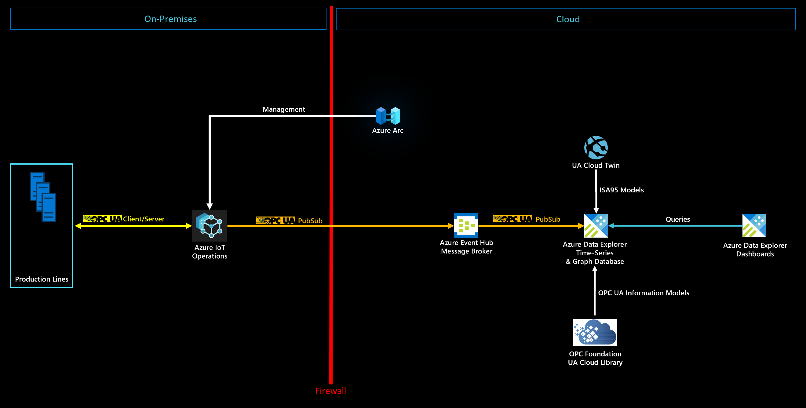
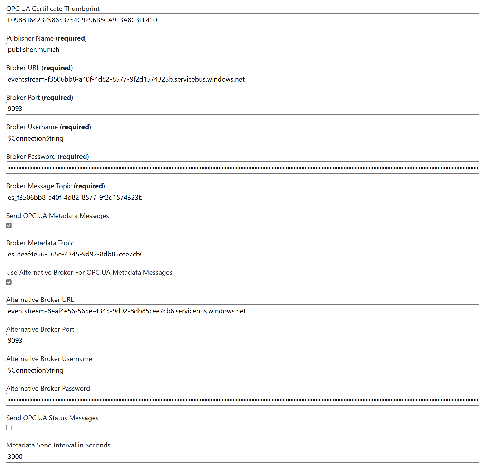
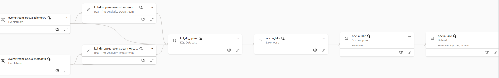
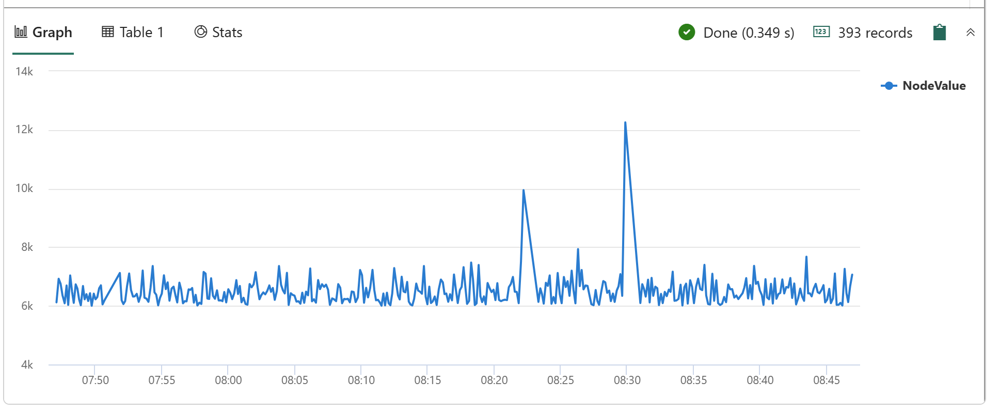
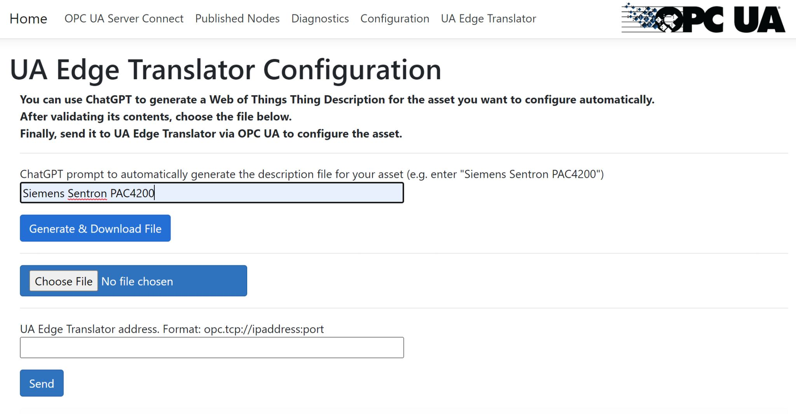

# Manufacturing Ontologies

## Table of Contents

* [Introduction](https://github.com/digitaltwinconsortium/ManufacturingOntologies?tab=readme-ov-file#introduction)
* [Reference Solution Architecture](https://github.com/digitaltwinconsortium/ManufacturingOntologies?tab=readme-ov-file#reference-solution-architecture)
* [UA Cloud Twin](https://github.com/digitaltwinconsortium/ManufacturingOntologies?tab=readme-ov-file#ua-cloud-twin)
* [A Cloud-based OPC UA Certificate Store and Persisted Storage](https://github.com/digitaltwinconsortium/ManufacturingOntologies?tab=readme-ov-file#a-cloud-based-opc-ua-certificate-store-and-persisted-storage)
* [UA Cloud Library](https://github.com/digitaltwinconsortium/ManufacturingOntologies?tab=readme-ov-file#ua-cloud-library)
* [Production Line Simulation](https://github.com/digitaltwinconsortium/ManufacturingOntologies?tab=readme-ov-file#production-line-simulation)
* [Calculating the Product Carbon Footprint (PCF)](https://github.com/digitaltwinconsortium/ManufacturingOntologies?tab=readme-ov-file#calculating-the-product-carbon-footprint-pcf)
* [Digital Feedback Loop with UA Cloud Commander and UA Cloud Action](https://github.com/digitaltwinconsortium/ManufacturingOntologies?tab=readme-ov-file#digital-feedback-loop-with-ua-cloud-commander-and-ua-cloud-action)
* [Installation of Production Line Simulation and Cloud Services](https://github.com/digitaltwinconsortium/ManufacturingOntologies?tab=readme-ov-file#installation-of-production-line-simulation-and-cloud-services)
* [Running the Production Line Simulation](https://github.com/digitaltwinconsortium/ManufacturingOntologies?tab=readme-ov-file#running-the-production-line-simulation)
* [Enabling the Kubernetes Cluster for Management via Azure Arc](https://github.com/digitaltwinconsortium/ManufacturingOntologies?tab=readme-ov-file#enabling-the-kubernetes-cluster-for-management-via-azure-arc)
* [Deploying Azure IoT Operations on the Edge](https://github.com/digitaltwinconsortium/ManufacturingOntologies?tab=readme-ov-file#deploying-azure-iot-operations-on-the-edge)
* [Condition Monitoring, Calculating OEE, Detecting Anomalies and Making Predictions in Azure Data Explorer](https://github.com/digitaltwinconsortium/ManufacturingOntologies?tab=readme-ov-file#condition-monitoring-calculating-oee-detecting-anomalies-and-making-predictions-in-azure-data-explorer)
* [Using Azure Managed Grafana Service](https://github.com/digitaltwinconsortium/ManufacturingOntologies?tab=readme-ov-file#using-azure-managed-grafana-service)
* [Enabling the Product Carbon Footprint Calculation (PCF) in the Asset Admin Shell (AAS) Repository](https://github.com/digitaltwinconsortium/ManufacturingOntologies?tab=readme-ov-file#enabling-the-product-carbon-footprint-calculation-pcf-in-the-asset-admin-shell-aas-repository)
* [Connecting the Reference Solution to Microsoft Power BI](https://github.com/digitaltwinconsortium/ManufacturingOntologies?tab=readme-ov-file#connecting-the-reference-solution-to-microsoft-power-bi)
* [Connecting the Reference Solution to Microsoft Dynamics 365 Field Service](https://github.com/digitaltwinconsortium/ManufacturingOntologies?tab=readme-ov-file#connecting-the-reference-solution-to-microsoft-dynamics-365-field-service)
* [A turn-key alternative: Microsoft Fabric](https://github.com/digitaltwinconsortium/ManufacturingOntologies?tab=readme-ov-file#a-turn-key-alternative-microsoft-fabric)
* [Connecting the Reference Solution to On-Premises SAP Systems](https://github.com/digitaltwinconsortium/ManufacturingOntologies?tab=readme-ov-file#connecting-the-reference-solution-to-on-premises-sap-systems)
* [Replacing the Production Line Simulation with a Real Production Line](https://github.com/digitaltwinconsortium/ManufacturingOntologies?tab=readme-ov-file#replacing-the-production-line-simulation-with-a-real-production-line)
* [Enabling Automatic Asset Onboarding with Azure OpenAI Service](https://github.com/digitaltwinconsortium/ManufacturingOntologies?tab=readme-ov-file#enabling-automatic-asset-onboarding-with-azure-openai-service)
* [License](https://github.com/digitaltwinconsortium/ManufacturingOntologies?tab=readme-ov-file#license)

## Introduction

An ontology defines the language used to describe a system. In the manufacturing domain, these systems can represent a factory or plant but also enterprise applications or supply chains. There are several established ontologies in the manufacturing domain. Most of them have long been standardized. In this repository, we have focused on two of these ontologies, namely ISA95 to describe a factory ontology and IEC 63278 Asset Administration Shell to describe a manufacturing supply chain. Furthermore, we have included a factory simulation and an end-to-end solution architecture for you to try out the ontologies, leveraging IEC 62541 OPC UA and the Microsoft Azure Cloud.

### Digital Twin Definition Language

The ontologies defined in this repository are described by leveraging the Digital Twin Definition Language (DTDL), which is specified [here](https://github.com/Azure/opendigitaltwins-dtdl/blob/master/DTDL/v2/DTDL.v2.md).

### W3C Web of Things

The ontologies defined in this repository are also described by leveraging the W3C Web of Things (WoT), which is specified [here](https://www.w3.org/TR/wot-thing-description/).

### International Society of Automation 95 (ISA95/IEC 62264)

ISA95 / IEC 62264 is one of the ontologies leveraged by this solution. It is a standard and described [here](https://en.wikipedia.org/wiki/ANSI/ISA-95) and [here](https://en.wikipedia.org/wiki/IEC_62264).

### IEC 63278 Asset Administration Shell (AAS)

The IEC 63278 Asset Administration Shell (AAS) enables vendor-neutral, platform-independent data exchange along a manufacturing supply chain and leveraged by this solution. The standard is described [here](https://www.plattform-i40.de/IP/Redaktion/EN/Standardartikel/specification-administrationshell.html). The reference solution provided in this repository contains an AAS Repository service from the Digital Twin Consortium's reference implementation [here](https://github.com/digitaltwinconsortium/AAS-Repository). This service makes the Product Carbon Footprint (PCF) of the simulated products built by the simulated production lines available to customers. Please see below about how to enable this service.

### IEC 62541 Open Platform Communications Unified Architecture (OPC UA)

This solution leverages IEC 62541 Open Platform Communications Unified Architecture (OPC UA) for all Operational Technology (OT) data. This standard is described [here](https://opcfoundation.org). 

## Reference Solution Architecture

This repository contains a reference solution leveraging the ontologies described above with an implementation on Microsoft Azure. Other implementations can be easily added by implementing the open interface IDigitalTwin within the UA Cloud Twin application.

Detailed architecture:

Here are the components involved in this solution:

| Component | Description |
| --- | --- |
| Industrial Assets | A set of simulated OPC-UA enabled production lines hosted in Docker containers |
| [Azure IoT Operations](https://learn.microsoft.com/en-us/azure/iot-operations/get-started/overview-iot-operations) | Azure IoT Operations is a unified data plane for the edge. It's composed of a set of modular, scalable, and highly available data services that run on Azure Arc-enabled edge Kubernetes clusters. |
| [UA Cloud Publisher](https://github.com/barnstee/ua-cloudpublisher) | This open-source reference application converts OPC UA Client/Server requests into OPC UA PubSub cloud messages. It's hosted in a Docker container. |
| [UA Cloud Commander](https://github.com/opcfoundation/ua-cloudcommander) | This open-source reference application converts messages sent to an MQTT or Kafka broker (possibly in the cloud) into OPC UA Client/Server requests for a connected OPC UA server. It's hosted in a Docker container. |
| [UA Edge Translator](https://github.com/OPCFoundation/UA-EdgeTranslator) | This open-source industrial connectivity reference application translates from proprietary asset interfaces to OPC UA leveraging W3C Web of Things (WoT) Thing Descriptions as the schema to describe the industrial asset interface. |
| [Data Gateway](https://learn.microsoft.com/en-us/azure/logic-apps/logic-apps-gateway-install#how-the-gateway-works) | This gateway connects your on-premises data sources (like SAP) to Azure Logic Apps in the cloud. |
| [AKS Edge Essentials](https://learn.microsoft.com/en-us/azure/aks/hybrid/aks-edge-overview) | This Kubernetes implementation (both K3S and K8S are supported) runs at the Edge and provides single- and multi-node Kubernetes clusters for a fault-tolerant Edge configuration on embedded or PC-class hardware, like an industrial gateway. |
| [Azure Event Hubs](https://learn.microsoft.com/en-us/azure/event-hubs/event-hubs-about) | The cloud message broker that receives OPC UA PubSub messages from edge gateways and stores them until they're retrieved by subscribers like the UA Cloud Twin. |
| [UA Cloud Twin](https://github.com/digitaltwinconsortium/UA-CloudTwin) | This open-source reference cloud application converts OPC UA PubSub cloud messages into digital twin updates. It also creates digital twins automatically by processing the cloud messages. Twins are instantiated from models in ISA95-compatible DTDL ontology. It's hosted in a Docker container. |
| [Azure Data Explorer](https://learn.microsoft.com/en-us/azure/synapse-analytics/data-explorer/data-explorer-overview) | The time series database and front-end dashboard service for advanced cloud analytics, including built-in anomaly detection and predictions. |
| [Azure Logic Apps](https://learn.microsoft.com/en-us/azure/logic-apps/logic-apps-overview) | Azure Logic Apps is a cloud platform you can use to create and run automated workflows with little to no code. |
| [UA Cloud Action](https://github.com/digitaltwinconsortium/UA-CloudAction) | This open-source reference cloud application queries the Azure Data Explorer for a specific data value (the pressure in one of the simulated production line machines) and calls UA Cloud Commander via Azure Event Hubs when a certain threshold is reached (4000 mbar). UA Cloud Commander then calls the OpenPressureReliefValve method on the machine via OPC UA. |
| [Azure Arc](https://learn.microsoft.com/en-us/azure/azure-arc/kubernetes/overview) | This cloud service is used to manage the on-premises Kubernetes cluster at the edge. New workloads can be deployed via Flux. |
| [Azure Storage](https://learn.microsoft.com/en-us/azure/storage/common/storage-introduction) | This cloud service is used to manage the OPC UA certificate store and settings of the Edge Kubernetes workloads. |
| [Azure Data Explorer Dashboards](https://github.com/digitaltwinconsortium/ManufacturingOntologies#condition-monitoring-calculating-oee-detecting-anomalies-and-making-predictions-in-azure-data-explorer) | This cloud app allows the creation of 2D viewers for your manufacturing data. |
| [Asset Admin Shell Repository](https://github.com/digitaltwinconsortium/AAS-Repository) | This open-source reference REST web service and application allows you to host Asset Administration Shells containing product information for your customers in a machine-readable format. |
| [AASX Package Explorer](https://github.com/admin-shell-io/aasx-package-explorer) | This app allows you to view and modify Asset Administration Shells on your PC. |
| [UA Cloud Metaverse](https://github.com/OPCFoundation/UA-CloudMetaverse) | This open-source Industrial Metaverse reference application allows you to view digital twins of your manufacturing assets via Augmented Reality or Virtual Reality headsets. Work in progress! |
| [Microsoft Sustainability Manager](https://github.com/digitaltwinconsortium/ManufacturingOntologies/blob/main/Tools/MicrosoftSustainabilityManager/configuremsm.md) | Microsoft Sustainability Manager is an extensible solution that unifies data intelligence and provides comprehensive, integrated, and automated sustainability management for organizations at any stage of their sustainability journey. It automates manual processes, enabling organizations to more efficiently record, report, and reduce their emissions. |
| [Azure Managed Grafana](https://learn.microsoft.com/en-us/azure/managed-grafana/overview) | Azure Managed Grafana is a data visualization platform built on top of the Grafana software by Grafana Labs. It's built as a fully managed Azure service operated and supported by Microsoft. |
| [Azure OpenAI Service](https://learn.microsoft.com/en-us/azure/cognitive-services/openai/overview) | Azure OpenAI Service provides REST API access to OpenAI's powerful language models including the GPT-4, GPT-35-Turbo, and Embeddings model series. |
| [UA Cloud Library](https://github.com/OPCFoundation/UA-CloudLibrary) | The UA Cloud Library is an online store of OPC UA Information Models, hosted by the OPC Foundation [here](https://uacloudlibrary.opcfoundation.org/). |
| [WattTime Service](https://www.watttime.org/api-documentation/#introduction) | The WattTime service can be used to get the carbon intensity for a unit of electrical energy consumed during a manufacturing process, specific to a particular geographic coordinate passed into the service. |
| [Microsoft Power BI](https://learn.microsoft.com/en-us/power-bi/fundamentals/power-bi-overview) | Microsoft Power BI is a collection of SaaS software services, apps, and connectors that work together to turn your unrelated sources of data into coherent, visually immersive, and interactive insights. |
| [Microsoft Dynamics 365 Field Service](https://learn.microsoft.com/en-us/dynamics365/field-service/overview) | Microsoft Dynamics 365 Field Service is a turnkey SaaS solution for managing field service requests. |

:exclamation: In a real-world deployment, something as critical as opening a pressure relief valve would of course be done on-premises and this is just a simple example of how to achieve the digital feedback loop.

Here are the data flow steps:

1. The UA Cloud Publisher reads OPC UA data from each simulated factory, and forwards it via OPC UA PubSub to Azure Event Hubs. 
1. Azure Data Explorer reads and processes the OPC UA data from Azure Event Hubs and generates time series data, which can be used for analytics, such as [OEE (Overall Equipment Effectiveness)](https://www.oee.com) calculation and predictive maintenance scenarios.

## UA Cloud Twin

The solution makes use of the UA Cloud Twin also available from the Digital Twin Consortium [here](https://github.com/digitaltwinconsortium/UA-CloudTwin).

#### Mapping OPC UA Servers to the ISA95 Hierarchy Model

UA Cloud Twin takes the combination of the OPC UA Application URI and the OPC UA Namespace URIs discovered in the OPC UA telemetry stream (specifically, in the OPC UA PubSub metadata messages) and creates OPC UA Nodeset digital twin instances (inherited from the ISA95 Work Center digital twin model) for each one. UA Cloud Publisher sends the OPC UA PubSub metadata messages to a separate broker topic to make sure all metadata can be read by UA Cloud Twin before the processing of the telemetry messages starts.

#### Mapping OPC UA PubSub Publishers to the ISA95 Hierarchy Model

UA Cloud Twin takes the OPC UA Publisher ID and creates ISA95 Area digital twin instances (derived from the digital twin model of the same name) for each one.

## A Cloud-based OPC UA Certificate Store and Persisted Storage

When running OPC UA applications, their OPC UA configuration files, keys and certificates must be persisted. While Kubernetes has the ability to persist these files in volumes, a safer place for them is the cloud, especially on single-node clusters where the volume would be lost when the node fails. This is why the OPC UA applications used in this solution (i.e. the UA Cloud Publisher, the MES and the simulated machines/production line stations) store their configuration files, keys and certificates in the cloud. This also has the advantage of providing a single location for mutually trusted certificates for all OPC UA applications.

## UA Cloud Library

The Asset Admin Shell Repository used in this reference solution reads OPC UA Information Models referenced by products described within Asset Admin Shells from the UA Cloud Library automatically. You can also read OPC UA Information Models directly from Azure Data Explorer (also used in this reference solution) and import the OPC UA nodes defined in the OPC UA Information Model into a table for lookup of additional metadata within queries. 

First, configure an Azure Data Explorer callout policy for the UA Cloud Library by running the following query on your ADX cluster (make sure you are an ADX cluster administrator, configurable under Permissions in the ADX tab in the Azure Portal):

        .alter cluster policy callout @'[{"CalloutType": "webapi","CalloutUriRegex": "uacloudlibrary.opcfoundation.org","CanCall": true}]'

Then, simply run the following Azure Data Explorer query from the Azure Portal:

        let uri='https://uacloudlibrary.opcfoundation.org/infomodel/download/<insert information model identifier from the UA Cloud Library here>';
        let headers=dynamic({'accept':'text/plain'});
        let options=dynamic({'Authorization':'Basic <insert your cloud library credentials hash here>'});
        evaluate http_request(uri, headers, options)
        | project title = tostring(ResponseBody.['title']), contributor = tostring(ResponseBody.contributor.name), nodeset = parse_xml(tostring(ResponseBody.nodeset.nodesetXml))
        | mv-expand UAVariable=nodeset.UANodeSet.UAVariable
        | project-away nodeset
        | extend NodeId = UAVariable.['@NodeId'], DisplayName = tostring(UAVariable.DisplayName.['#text']), BrowseName = tostring(UAVariable.['@BrowseName']), DataType = tostring(UAVariable.['@DataType'])
        | project-away UAVariable
        | take 10000

You need to provide two things in the query above:

1. The Information Model's unique ID from the UA Cloud Library and enter it into the <insert information model identifier from cloud library here> field of the ADX query.
1. Your UA Cloud Library credentials (generated during registration) basic authorization header hash and insert it into the <insert your cloud library credentials hash here> field of the ADX query. Use tools like https://www.debugbear.com/basic-auth-header-generator to generate this.

## Production Line Simulation

The solution leverages a production line simulation made up of several stations, leveraging an OPC UA information model, as well as a simple Manufacturing Execution System (MES). Both the Stations and the MES are containerized for easy deployment.

### Default Simulation Configuration

The simulation is configured to include 2 production lines. The default configuration is depicted below:

| Production Line | Ideal Cycle Time (in seconds) |
| --- | --- |
| Munich | 6 |
| Seattle |	10 |

| Shift Name | Start | End |
| --- | --- | --- |
| Morning | 07:00 | 14:00 |
| Afternoon | 15:00 | 22:00 |
| Night | 23:00 | 06:00 |

Note: Shift times are in local time, i.e. the time zone the VM hosting the production line simulation is set to!

### OPC UA Node IDs of Station OPC UA Server

The following OPC UA Node IDs are used in the Station OPC UA Server for telemetry to the cloud
* i=379 - manufactured product serial number
* i=385 - number of manufactured products
* i=391 - number of discarded products
* i=398 - running time
* i=399 - faulty time
* i=400 - status (0=station ready to do work, 1=work in progress, 2=work done and good part manufactured, 3=work done and scrap manufactured, 4=station in fault state)
* i=406 - energy consumption
* i=412 - ideal cycle time
* i=418 - actual cycle time
* i=434 - pressure

## Calculating the Product Carbon Footprint (PCF)

One of the most popular use cases for the Asset Administration Shell (AAS) is to make the Product Carbon Footprint (PCF) of manufactured products available to customers of those products. In fact, the AAS will most likely become the underlying technology in the upcoming [Digital Product Passport (DPP)](https://circulareconomy.europa.eu/platform/en/news-and-events/all-events/eu-digital-product-passport-learning-frontrunners) initiative from the European Union. To calculate the PCF, all three scopes (1, 2 & 3) of emissions need to be taken into account. See [here](https://github.com/digitaltwinconsortium/ManufacturingOntologies#enabling-the-product-carbon-footprint-calculation-pcf-in-the-asset-admin-shell-aas-repository) about how to enable the AAS to calculate and provide the PCF to external consumers via a standardized REST interface and see [here](https://github.com/digitaltwinconsortium/ManufacturingOntologies/blob/main/Tools/MicrosoftSustainabilityManager/configuremsm.md) about how to enable the Microsoft Sustainability Manager (MSM) to calculate the PCF.

### Scope 1 Emissions

These emissions come from all sources the manufacturer uses to burn fossil fuels, either during production (for example when the manufacturer has a natural gas-powered production process) or before (for example picking up parts by truck) or afterwards (for example the cars of sales people or the delivery trucks with the produced products). They are relatively easy to calculate as the emissions from fossil fuel-powered engines are a well-understood quantity. This reference solution simply adds a fixed value for scope 1 emissions to the total product carbon footprint.

### Scope 2 Emissions

These emissions come from the electricity used during production. If the manufacturer uses a 100% renewable energy provider, the scope 2 emissions are zero. However, most manufacturers have long-term contracts with energy providers and need to ask their energy provider for the carbon intensity per KWh of energy delivered. If this data is not available, an average for the electricity grid region the manufacturing site is in should be used. This data is available through services like [WattTime](https://www.watttime.org) and this is what this reference solution uses via the built-in [Asset Admin Shell Repository](https://github.com/digitaltwinconsortium/AAS-Repository) also available open-source from the Digital Twin Consortium. Please see below on how to configure this part of the reference solution after deployment. The PCF calculation first checks if a new product was successfully produced by the production line, retrieves the produced product's serial number, followed by the energy consumption of each machine of the production line while the new product was produced by the machine and then applies the carbon intensity to the sum of all machines' energy consumption.

### Scope 3 Emissions

These emissions come from the parts and raw materials used within the product being manufactured as well as from using the product by the end customer (and getting it into the customer's hands in the first place!) and are the hardest to calculate simply due to a lack of data from the worldwide suppliers manufacturer uses today. Unfortunately, scope 3 emissions make up almost 90% of the emissions in manufacturing. However, this is where the AAS can help create a standardized interface and data model to provide and retrieve scope 3 emissions. This reference solution does just that by making an AAS available for each manufactured product built by the simulated production line and also reads PCF data from another AAS simulating a manufacturing supply chain.

## Digital Feedback Loop with UA Cloud Commander and UA Cloud Action

This reference implementation implements a "digital feedback loop", i.e. triggering a command on one of the OPC UA servers in the simulation from the cloud, based on a time-series reaching a certain threshold (the simulated pressure). You can see the pressure of the assembly machine in the Seattle production line being released on regular intervals in the Azure Data Explorer dashboard.

## Installation of Production Line Simulation and Cloud Services

Clicking on the button below will **deploy** all required resources (on Microsoft Azure):

Note: During deployment, you must provide a password for a VM used to host the production line simulation and for UA Cloud Twin. The password must have 3 of the following: 1 lower case character, 1 upper case character, 1 number, and 1 special character. The password must be between 12 and 72 characters long.

Note: To save cost, the deployment deploys just a single Windows 11 Enterprise VM for both the production line simulation and the base OS for the Azure Kubernetes Services Edge Essentials instance. In production scenarios, the production line simulation is obviously not required and for the base OS for the Azure Kubernetes Services Edge Essentials instance, we recommend Windows IoT Enterprise Long Term Servicing Channel (LTSC).

Once the deployment completes, connect to the deployed Windows VM with an RDP (remote desktop) connection. You can download the RDP file in the [Azure portal](https://portal.azure.com) page for the VM, under the **Connect** options. Sign in using the credentials you provided during deployment, open an **Administrator Powershell window**, navigate to the `C:\ManufacturingOntologies-main\Deployment` directory and run
     
    New-AksEdgeDeployment -JsonConfigFilePath .\aksedge-config.json

Once the command is finished, your Azure Kubernetes Services Edge Essentials installation is complete and you can run the production line simulation.

Note: To get logs from all your Kubernetes workloads and services at any time, simply run `Get-AksEdgeLogs` from an **Administrator Powershell window**.

Note: To check the memory utilization of your Kubernetes cluster, simply run `Invoke-AksEdgeNodeCommand -Command "sudo cat /proc/meminfo"` from an **Administrator Powershell window**.

## Running the Production Line Simulation

From the deployed VM, open a **Windows command prompt**, navigate to the `C:\ManufacturingOntologies-main\Tools\FactorySimulation` directory and run the **StartSimulation** command by supplying the following parameters:

Syntax:

    StartSimulation <EventHubsCS> <StorageAccountCS> <AzureSubscriptionID> <AzureTenantID>

Parameters:

| Parameter | Description |
| --- | --- |
| EventHubCS | Copy the Event Hubs namespace connection string as described [here](https://learn.microsoft.com/en-us/azure/event-hubs/event-hubs-get-connection-string). |
| StorageAccountCS | In the Azure Portal, navigate to the Storage Account created by this solution. Select "Access keys" from the left-hand navigation menu. Then, copy the connection string for key1. |
| AzureSubscriptionID | In Azure Portal, browse your Subscriptions and copy the ID of the subscription used in this solution. |
| AzureTenantID | In Azure Portal, open the Microsoft Entry ID page and copy your Tenant ID. |

Example: StartSimulation Endpoint=sb://ontologies.servicebus.windows.net/;SharedAccessKeyName=RootManageSharedAccessKey;SharedAccessKey=abcdefgh= DefaultEndpointsProtocol=https;AccountName=ontologiesstorage;AccountKey=abcdefgh==;EndpointSuffix=core.windows.net 9dd2eft0-3dad-4aeb-85d8-c3adssd8127a 6e660ce4-d51a-4585-80c6-58035e212354

Note: If you have access to several Azure subscriptions, it is worth first logging into the Azure Portal from the VM through the web browser. You can also switch Active Directory tenants through the Azure Portal UI (in the top-right-hand corner), to make sure you are logged in to the tenant used during deployment. Once logged in, simply leave the browser window open. This will ensure that the StartSimulation script can more easily connect to the right subscription.

Note: In this solution, the OPC UA application certificate store for UA Cloud Publisher, as well as the simulated production line's MES and individual machines' store, is located in the cloud in the deployed Azure Storage account.

## Enabling the Kubernetes Cluster for Management via Azure Arc

1. On your virtual machine, open an **Administrator PowerShell window**, navigate to the `C:\ManufacturingOntologies-main\Deployment` directory and run `CreateServicePrincipal`. The two parameters `subscriptionID` and `tenantID` can be retrieved from the Azure Portal.
1. Run `notepad aksedge-config.json` and provide the following information:

    | Attribute | Description |
    | --- | --- |
    | Location | The Azure location of your resource group. You can find this in the Azure portal under the resource group which was deployed for this solution, but remove the spaces in the name! Currently supported regions are eastus, eastus2, westus, westus2, westus3, westeurope and northeurope. |
    | SubscriptionId | Your subscription ID. In the Azure portal, click on the subscription you're using and copy/paste the subscription ID. |
    | TenantId | Your tenant ID. In the Azure portal, click on Azure Active Directory and copy/paste the tenant ID. |
    | ResourceGroupName | The name of the Azure resource group which was deployed for this solution. |
    | ClientId | The name of the Azure Service Principal previously created. AKS uses this service principal to connect your cluster to Arc. |
    | ClientSecret | The password for the Azure Service Principal. |

1. Save the file, close the Powershell window, open a new **Administrator Powershell window**, navigate back to the `C:\ManufacturingOntologies-main\Deployment` directory and run `SetupArc`.

You can now manage your Kubernetes cluster from the cloud via the newly deployed Azure Arc instance. In the Azure Portal, browse to the Azure Arc instance and select Workloads. The required service token can be retrieved via `Get-AksEdgeManagedServiceToken` from an **Administrator Powershell window** on your virtual machine.

## Deploying Azure IoT Operations on the Edge

Please make sure you have already started the production line simulation and enabled the Kubernetes Cluster for management via Azure Arc as described in the previous paragraphs. Then, follow these steps:

1. From the Azure Portal, navigate to the Key Vault deployed in this reference solution and add your own identity to the access policies by clicking `Access policies`, `Create`, select the `Keys, Secrets & Certificate Management` template, click `Next`, search for and select your own user identity, click `Next`, leave the Application section blank, click `Next` and finally `Create`.
1. Enable custom locations for your Arc-connected Kubernetes cluster (called ontologies_cluster) by first logging in to your Azure subscription via `az login` from an **Administrator PowerShell Window** and then running `az connectedk8s enable-features -n "ontologies_cluster" -g "<resourceGroupName>" --features cluster-connect custom-locations`, providing the `resourceGroupName` from the reference solution deployed.
1. From the Azure Portal, navigate to the Azure Storage deployed in this reference solution, open the `Storage browser` and then `Blob containers`. Here you can access the cloud-based OPC UA certificate store used in this solution. Azure IoT Operations uses Azure Key Vault as the cloud-based OPC UA certificate store so the certificates need to be copied:
    1. From within the Azure Storage browser's Blob containers, for each simulated production line, navigate to the app/pki/trusted/certs folder, select the assembly, packaging and test cert file and download it.
    1. Log in to your Azure subscription via `az login` from an **Administrator PowerShell Window** and then run `az keyvault secret set --name "<stationName>-der" --vault-name <keyVaultName> --file .<stationName>.der --encoding hex --content-type application/pkix-cert`, providing the `keyVaultName` and `stationName` of each of the 6 stations you downloaded a .der cert file for in the previous step.
1. From an **Windows command prompt** on a Windows 11 PC, run `wsl`. This will start the Windows Subsystem for Linux. If this is not yet installed, you can install it by running `wsl --install` and rebooting. Then follow the instructions [here](https://learn.microsoft.com/en-us/azure/iot-operations/manage-devices-assets/howto-configure-opcua-authentication-options#configure-opc-ua-transport-authentication) and [here](https://learn.microsoft.com/en-us/azure/iot-operations/manage-devices-assets/howto-configure-opcua-authentication-options#create-a-self-signed-certificate-for-transport-authorization) to create an OPC UA certificate and private key for Azure IoT Operations and upload both to the Key Vault deployed in this reference solution. The step `Configure the secret provider class aio-opc-ua-broker-client-certificate custom resource` will be completed later. 
1. From the Azure Portal, deploy Azure IoT Operations by navigating to your Arc-connected kubernetes cluster, click on `Extensions`, `Add`, select `Azure IoT Operations` and click `Create`. On the Basic page, leave everything as-is. On the Configuration page, set the MQ mode to `Auto`. You don't need to deploy a simulated PLC, as this reference solution already contains a much more substancial production line simulation. On the Automation page, select the Key Vault deployed for this reference solution and then copy the `az iot ops init` command automatically generated. From your deployed VM, open a new **Administrator PowerShell Window**, login to the correct Azure subscription by running `az login` and then run the `az iot ops init` command. Once the command completes, click `Next` and then close the wizard. 
1. Once deployment completes and all Kubernetes pods are up and running, log in to your Azure subscription via `az login` from an **Administrator PowerShell Window** and then run `kubectl apply -f secretsprovider.yaml` with the updated screts provider resource file provided in the `C:\ManufacturingOntologies-main\Tools\FactorySimulation\Station` directory, providing the Key Vault name, the Azure tenant ID and the station cert file names and aliases you uploaded to Azure Key Vault previously.
1. From a web browser, log in to https://iotoperations.azure.com, pick the right Azure directory (top right hand corner) and start creating assets from the production line simulation. As mentioned above, the solution comes with 2 production lines (Munich and Seattle) consisting of 3 stations each (assembly, test and packaging):
    1. For the asset endpoints, enter opc.tcp://assembly.munich in the OPC UA Broker URL field for the assembly station of the Munich production line, etc.
    1. For the asset tags, select `Import CSV file` and open the `StationTags.csv` file located in the `C:\ManufacturingOntologies-main\Tools\FactorySimulation\Station` directory.

## Condition Monitoring, Calculating OEE, Detecting Anomalies and Making Predictions in Azure Data Explorer

You can also visit the [Azure Data Explorer documentation](https://learn.microsoft.com/en-us/azure/synapse-analytics/data-explorer/data-explorer-overview) to learn how to create no-code dashboards for condition monitoring, yield or maintenance predictions, or anomaly detection. We have provided a sample dashboard in the `./Tools/ADXQueries` folder for you to deploy to the ADX Dashboard by following the steps outlined [here](https://learn.microsoft.com/en-us/azure/data-explorer/azure-data-explorer-dashboards#to-create-new-dashboard-from-a-file). After import, you need to update the dashboard's data source by specifying the HTTPS endpoint of your ADX server cluster instance in the format `https://ADXInstanceName.AzureRegion.kusto.windows.net/` in the top-right-hand corner of the dashboard. 

Note: If you want to display the OEE for a specific shift, select `Custom Time Range` in the `Time Range` drop down in the top-left hand corner of the ADX Dashboard and enter the date and time from start to end of the shift you are interested in. 

## Using Azure Managed Grafana Service

You can also leverage Grafana to create a dashboard on Azure for this reference solution. Please see the documentation [here](https://github.com/digitaltwinconsortium/ManufacturingOntologies/blob/main/Tools/GrafanaDashboard/configuregrafana.md).

## Enabling the Product Carbon Footprint Calculation (PCF) in the Asset Admin Shell (AAS) Repository

The Asset Admin Shell (AAS) Repository is automatically configured during deployment of the reference solution, but for the Product Carbon Footprint (PCF) calculation, a WattTime service account needs to be provided. Please refer to [the WattTime API documentation](https://www.watttime.org/api-documentation/#best-practices-for-api-usage) on how to register for an account. Once your account has been activated, provide your username and password in the settings of the AAS Repo website from the Azure Portal via YourDeploymentName-AAS-Repo -> Configuration -> Application settings.

## Connecting the Reference Solution to Microsoft Power BI

1. You need access to a Power BI subscription.
1. Install the Power BI Desktop app from [here](https://go.microsoft.com/fwlink/?LinkId=2240819&clcid=0x409).
1. Login to Power BI Desktop app using the user with access to the Power BI subscription.
1. From the Azure Portal, navigate to your Azure Data Explorer database instance (`ontologies`) and add `Database Admin` permissions to an Azure Active Directory user with access to just a **single** Azure subscription, i.e. the subscription used for your deployed instance of this reference solution. Create a new user in Azure Active Directory if you have to.
1. From Power BI, create a new report and select Azure Data Explorer time-series data as a data source via `Get data` -> `Azure` -> `Azure Data Explorer (Kusto)`.
1. In the popup window, enter the Azure Data Explorer endpoint of your instance (e.g. `https://erichbtest3adx.eastus2.kusto.windows.net`), the database name (`ontologies`) and the following query:

        let _startTime = ago(1h);
        let _endTime = now();
        opcua_metadata_lkv
        | where Name contains "assembly"
        | where Name contains "munich"
        | join kind=inner (opcua_telemetry
            | where Name == "ActualCycleTime"
            | where Timestamp > _startTime and Timestamp < _endTime
        ) on DataSetWriterID
        | extend NodeValue = todouble(Value)
        | project Timestamp, NodeValue

1. Click `Load`. This will import the actual cycle time of the Assembly station of the Munich production line for the last hour.
1. When prompted, log into Azure Data Explorer using the Azure Active Directory user you gave permission to access the Azure Data Explorer database earlier.
1. From the `Data view`, select the NodeValue column and select `Don't summarize` in the `Summarization` menu item.
1. Switch to the `Report view`.
1. Under `Visualizations`, select the `Line Chart` visualization.
1. Under `Visualizations`, move the `Timestamp` from the `Data` source to the `X-axis`, click on it and select `Timestamp`.
1. Under `Visualizations`, move the `NodeValue` from the `Data` source to the `Y-axis`, click on it and select `Median`.
1. Save your new report.

Note: You can add other data from Azure Data Explorer to your report similarily.

## Connecting the Reference Solution to Microsoft Dynamics 365 Field Service

The integration is documented [here](https://github.com/digitaltwinconsortium/ManufacturingOntologies/blob/main/Tools/DynamicsFS/ConfigureDynamicsFS.md).

## A Turn-Key Alternative: Microsoft Fabric

[Microsoft Fabric](https://learn.microsoft.com/en-us/fabric/get-started/microsoft-fabric-overview) is an all-in-one analytics solution that covers everything from data movement to data science, analytics, and business intelligence. It offers a comprehensive suite of services, including data lake, data engineering, and data integration, all in one place. You don't even need an Azure subscription for it, let alone deploy or manage any apps or services. As a simpler alternative to the reference solution provided in this repository, you can get started with Microsoft Fabric [here](https://learn.microsoft.com/en-us/fabric/get-started/fabric-trial).

To configure Microsoft Fabric for production line data, you need at least 1 OPC UA server integrated into your produciton line that support OPC UA PubSub. Alternatively, you can use an OPC UA Client/Server to OPC UA PubSub adapter app like UA Cloud Publisher used in this reference solution. Then follow these steps:

1. Log into Microsoft Fabric [here](https://fabric.microsoft.com).
1. Create a `KQL Database` by clicking `Create` -> `See all` -> `KQL Database` and give it a name, e.g. `kql_db_opcua`. Click `Create`.
1. Under `Database details`, edit the `OneLake folder` setting and set it to `Active`. This will enable sharing your OPC UA time-series data from your production line within your organization via [OneLake](https://learn.microsoft.com/en-us/fabric/onelake/onelake-overview) in [Parquet file format](https://parquet.apache.org/docs/file-format/). Click `Done`.
1. Create the tables you need for ingesting the OPC UA PubSub production line data by clicking `Check your data`, deleting the sample data in the text box and by entering the following Kusto command, one at a time and then clicking `Run` for each line:

        .create table opcua_raw(payload: dynamic)

        .create table opcua_metadata_raw (payload: dynamic) 

        .create table opcua_raw ingestion json mapping "opcua_mapping" @'[{"column":"payload","path":"$","datatype":"dynamic"}]'

        .create table opcua_metadata_raw ingestion json mapping "opcua_metadata_mapping" @'[{"column":"payload","path":"$","datatype":"dynamic"}]'

        .create table opcua_intermediate(DataSetWriterID: string, Timestamp: datetime, Payload: dynamic)

        .create table opcua_telemetry (DataSetWriterID: string, Timestamp: datetime, Name: string, Value: dynamic)

        .create table opcua_metadata (DataSetWriterID: string, Name: string) 

1. Create the OPC UA PubSub production line data parsing functions, by entering the following function definitions, one at a time, clicking `Run` for each line:

        .create-or-alter function OPCUARawExpand() {
            opcua_raw
            |mv-expand records = payload.Messages
            | where records != ''
            |project 
              DataSetWriterID = tostring(records["DataSetWriterId"]),
              Timestamp = todatetime(records["Timestamp"]),
              Payload = todynamic(records["Payload"])
         }

         .create-or-alter function OPCUADatasetExpand() {
            opcua_intermediate
            | mv-apply Payload on (
                extend key = tostring(bag_keys(Payload)[0])
                | extend p = Payload[key]
                | project Name = key, Value = todynamic(p.Value)
            )
        }

        .create-or-alter function OPCUAMetaDataExpand() {
            opcua_metadata_raw
            | project DataSetWriterId = tostring(payload.DataSetWriterId), Name = tostring(payload.MetaData.Name)
        }

1. Apply the OPC UA PubSub parsing functions to your tables, by entering the following policy updates, one at a time, clicking `Run` for each line:
 
        .alter table opcua_intermediate policy update @'[{"Source": "opcua_raw", "Query": "OPCUARawExpand()", "IsEnabled": "True"}]'

        .alter table opcua_telemetry policy update @'[{"Source": "opcua_intermediate", "Query": "OPCUADatasetExpand()", "IsEnabled": "True"}]'

        .alter table opcua_metadata policy update @'[{"Source": "opcua_metadata_raw", "Query": "OPCUAMetaDataExpand()", "IsEnabled": "True"}]'

1. Create a "Last Known Value" OPC UA PubSub metadata table to make sure you always use the latest metadata available, by entering the following materialized view definition and clicking `Run`:

        .create materialized-view opcua_metadata_lkv on table opcua_metadata
        {
            opcua_metadata
            | extend iTime = ingestion_time()
            | summarize arg_max(iTime, *) by Name, DataSetWriterID
        }

1. Create an `Eventstream` by clicking `Create` -> `See all` -> `Eventstream` and give it a name (e.g. `eventstream_opcua_telemetry`). Click `Create`. This component will receive the OPC UA PubSub production line telemetry and send it to your KQL database.
1. Click `New source` and select `Custom App` and give it a name (e.g. `opcua_telemetry`). Click `Add`. In the `Information` box, click on `Connection string-primary key` and copy it. You will need it soon when configuring UA Cloud Publisher.
1. Create another `Eventstream` by clicking `Create` -> `See all` -> `Eventstream` and give it a name (e.g. `eventstream_opcua_metadata`). Click `Create`. This component will receive the OPC UA PubSub production line metadata and send it to your KQL database.
1. Click `New source` and select `Custom App` and give it a name (e.g. `opcua_metadata`). Click `Add`. In the `Information` box, click on `Connection string-primary key` and copy it. You will need it soon when configuring UA Cloud Publisher.
1. Now configure UA Cloud Publisher. You can either follow the steps for connecting your own production line described [here](https://github.com/digitaltwinconsortium/ManufacturingOntologies#replacing-the-production-line-simulation-with-a-real-production-line) or you can modify the configuration of the UA Cloud Publisher setup in the production line simulation provided in this repository, for example for the Munich production line. For the latter, follow these steps:
   1. Log into the VM deployed with this reference solution, open an **Administrator Powershell window** and run `Get-AksEdgeNodeAddr` as well as `kubectl get services -n munich`.
   1. Open a browser on the VM and enter the IP address and port retrieved for UA Cloud Publisher in the previous step in the address field (e.g. `http://192.168.0.2:30356`) to access the UA Cloud Publisher UI.
   1. In the UA Cloud Publisher UI, click `Configuration` and enter the `Connection string-primary key` from the `opcua_telemetry` custom app you copied earlier into the `Broker Password` field, enter `$ConnectionString` into the `Broker Username` field, enter the `EntityPath` into the `Broker Message Topic` (the entity path is contained at the end of the connection string and starts with "es_") and the name of your custom app into the `Broker URL` field (the custom app name is contained within the connection string and starts with `eventstream-` and ends with `.servicebus.windows.net`).
   1. Select the checkbox `Use Alternative Broker For OPC UA Metadata Messages` and enter the `Connection string-primary key` from the `opcua_metadata` custom app you copied earlier into the `Alternative Broker Password` field, enter `9093` in the `Alternative Broker Port` field, enter `$ConnectionString` into the `Alternative Broker Username` field, enter the `EntityPath` into the `Broker Metadata Topic` (the entity path is contained at the end of the connection string and starts with "es_") and the name of your custom app into the `Alternative Broker URL` field (the custom app name is contained within the connection string and starts with `eventstream-` and ends with `.servicebus.windows.net`).
   1. Set the `Metadata Send Interval in Seconds` to `3000`.

        

   1. Click `Apply` at the top of the configuration page. 
   1. In the UA Cloud Publisher UI, click `Diagnostics` and verify that you have a connection to Microsoft Fabric (`Connected to broker(s)` is set to `True`).
1. Back in Microsoft Fabric, select your workspace, click on your `eventstream_opcua_telemetry` event stream and select `Open Eventsteam`.
1. Click `New destination` and select `KQL Database` and give it a name (e.g. `kql_db_opcua_telemetry`). Under `Workspace`, select you Fabric workspace (e.g. `My workspace`) and under `KQL Database`, select your KQL database you setup earlier. Click `Add and configure`.
1. In the `Ingest data` popup window, under `Table`, select `Existing table`, select `opcua_raw` and click `Next: Source`. Leave everything the way it is and click `Next: Schema`. Wait a few seconds for the ingested data to be made available. Under `Data format`, select `JSON`. Under `Mapping name`, select `Use existing mapping` and select `opcua_mapping`. Click `Next: Summary`. Click `Close`.
1. Select your workspace, click on your `eventstream_opcua_metadata` event stream and select `Open Eventsteam`.
1. Click `New destination` and select `KQL Database` and give it a name (e.g. `kql_db_opcua_metadata`). Under `Workspace`, select you Fabric workspace (e.g. `My workspace`) and under `KQL Database`, select your KQL database you setup earlier. Click `Add and configure`.
1. In the `Ingest data` popup window, under `Table`, select `Existing table`, select `opcua_raw_metadata` and click `Next: Source`. Leave everything the way it is and click `Next: Schema`. Wait a few seconds for the ingested data to be made available. Under `Data format`, select `JSON`. Under `Mapping name`, select `Use existing mapping` and select `opcua_metadata_mapping`. Click `Next: Summary`. Click `Close`.
1. To share your OPC UA data via OneLake, create a `Lakehouse` by clicking `Create` -> `See all` -> `Lakehouse` and give it a name, e.g. `opcua_lake`. Click `Create`.
1. Click `New shortcut`, select `Microsoft OneLake`, select your KQL database, expand the `Tables` and select `opcua_telemetry`.
1. Click `New shortcut`, select `Microsoft OneLake`, select your KQL database, expand the `Tables` and select `opcua_metadata`.
1. Click on your workspace, select `Lineage view` to see the entire flow of OPC UA data you have just setup in Microsoft Fabric:

    

1. Click on our KQL Database and select `Open KQL Database` followed by `Check your data`. Delete the sample queries and enter the following query in the text box:

         let _startTime = ago(1h);
         let _endTime = now();
         opcua_metadata_lkv
         | where Name contains "assembly"
         | where Name contains "munich"
         | join kind=inner (opcua_telemetry
             | where Name == "ActualCycleTime"
             | where Timestamp > _startTime and Timestamp < _endTime
         ) on DataSetWriterID
         | extend NodeValue = todouble(Value)
         | project Timestamp, NodeValue
         | sort by Timestamp desc 
         | render linechart 

This will result in is a line graph rendered directly in Fabric:

## Connecting the Reference Solution to On-Premises SAP Systems

Note: If you want to simply try out SAP connectivity before connecting your real SAP system, you can deploy an `SAP S/4 HANA Fully-Activated Appliance` to Azure from [here](https://cal.sap.com/catalog#/applianceTemplates) and use that instead.

The Azure services handling connectivity to your on-premises SAP systems is called Azure Logic Apps. Azure Logic Apps is a no-code Azure service to orchestrate workflows that can trigger actions.

### Configuring Azure Logic Apps to Receive Data From On-Premises SAP Systems

To create a new Azure Logic Apps workflow from your on-premises SAP system to Azure Logic Apps and also store the data sent from SAP in your Azure Storage Account deployed in this reference solution, follow these steps:

1. Deploy an instance of Azure Logic Apps in the same region you picked during deployment of this reference solution via the Azure Portal. Select the consumption-based version.
1. From the Azure Logic App Designer, select the trigger template `When a HTTP request is received`.
1. Select `+ New step`, select `Azure File Storage` and select `Create file`. Give the connection a name and select the storage account name of the Azure Storage Account deployed for this reference solution. For `Folder path`, enter `sap`, for `File name` enter `IDoc.xml` and for `File content` select `Body` from the dynamic content. In the Azure Portal, navigate to your storage account deployed in this reference solution, select `Storage browser`, select `File shares` and select `Add file share`. Enter `sap` for the name and select `Create`.
1. Hover over the arrow between your trigger and your create file action, select the `+` button and select `Add a parallel branch`. Select `Azure Data Explorer` and add the action `Run KQL query` from the list of Azure Data Explorer actions available. Specify the ADX instance (Cluster URL) name and database name of your Azure Data Explorer service instance deployed in this reference solution. In the query field, enter `.create table SAP (name:string, label:string)`.
1. Save your workflow.
1. Select `Run Trigger` and wait for the run to complete. Verify that there are green check marks on all three components of your workflow. If you see any red exclamation marks, select the component for more info regardig the error.

Copy the `HTTP GET URL` from your HTTP trigger in your workflow. You will need it when configuring SAP in the next step.

### Configuring Your On-Premises SAP System to Send Data to Azure Logic Apps

1.	Log into the SAP windows VM
2.	Once at the VM desktop, Click on `SAP Logon` 
3.	Click `Log On` in the top left conner of the app

4.	Log on with the `BPINST` user name, and `Welcome1` password
5.	In the top right conner search for `SM59`. This should bring up the `Configuration of RFC Connections` screen. 

6.	Click on `Edit` and `Create` at the top of the app. 
7.	Enter `LOGICAPP` in the `Destination` field
8.	From the `Connection Type` dropdown select `HTTP Connection to external server`
9.	Click The green check at the bottom of the window. 

10.	In the `Description 1` box put `LOGICAPP`
11.	Click the `Technical Settings` tab and fill in the `Host` field with the `HTTP GET URL` from the logic app you copied from above (e.g. prod-51.northeurope.logic.azure.com) . In `Port` put `443`. And in `Path Prefix` enter the rest of the `HTTP GET URL` starting with `/workflows/...`

12.	Click the `Login & Security` tab. 
13.	Scroll down to `Security Options`  and set `SSL` to `Active`
14.	Click `Save`
15.	In the main app from step 5, search for `WE21`. This will bring up the `Ports in IDoc processing`.
16.	Select the `XML HTTP` folder and click `Create`. 
17.	In the `Port` field input `LOGICAPP`
18.	In the `RFC destination` select `LOGICAPP`. 
19.	Click `Green Check` to `Save`

20. Create a partner profile for your Azure Logic App in your SAP system by entering `WE20` from the SAP system's search box, which will bring up the `Partner profiles` screen. 
21. Expand the `Partner Profiles` folder and select the `Partner Type LS` (Logical System) folder. 
21. Click on the `S4HCLNT100` partner profile. 
23. Click on the `Create Outbound Parameter` button below the `Outbound` table. 

24. In the `Partner Profiles: Outbound Parameters` dialog, enter `INTERNAL_ORDER` for `Message Type`. In the `Outbound Options` tab, enter `LOGICAPP` for `Receiver port`. Select the `Pass IDoc Immediately` radio button. For `Basic type` enter `INTERNAL_ORDER01`. Click the `Save` button.

### Testing your SAP to Azure Logic App Workflow

To try out your SAP to Azure Logic App workflow, follow these steps:

1.	In the main app, search for `WE19`. This should bring up the `Test Tool for IDoc Processing` screen.  
2.	Select `Using message type` and enter `INTERNAL_ORDER` 
3.	Click `Create` at the top left corner of the screen. 
4.	Click the `EDICC` field. 
5.	A `Edit Control Record Fields`  screen should open up. 
6.	In the `Receiver` section: `PORT` enter `LOGICAPP`, `Partner No.` enter `S4HCLNT100`, `Part. Type` enter `LS`
7.	In the `Sender` section: `PORT` enter `SAPS4H`, `Partner No.` enter `S4HCLNT100`, `Part. Type` enter `LS`
8.	Click the green check at the bottom of the window. 

9.	Click `Standard Outbound Processing` tab at the top of the screen. 
10.	In the `Outbound Processing of IDoc` dialog, click the green check button to start the IDoc message processing

Open the Storage browser of your Azure Storage Account, select Files shares and check that a new `IDoc.xml` file was created in the `sap` folder.

Note: To check for IDoc message processing errors, entering `WE09` from the SAP system's search box, select a time range and click the `execute` button. This will bring up the `IDoc Search for Business Content` screen and you can select each IDoc for processing errors in the table displayed.

### Microsoft On-Premises Data Gateway

Microsoft provides an on-premises data gateway for sending data **to** on-premises SAP systems from Azure Logic Apps.

Note: To receive data **from** on-premises SAP systems to Azure Logic Apps in the cloud, the SAP connector and on-premises data gateway is **not** required.

To install the on-premises data gateway, follow these steps:

1. Download and install the on-premises data gateway from [here](https://aka.ms/on-premises-data-gateway-installer). Pay special attention to the [prerequisits](https://learn.microsoft.com/en-us/azure/logic-apps/logic-apps-gateway-install#prerequisites)! For example, if your Azure account has access to more than one Azure subscription, you need to use a different Azure account to install the gateway and to create the accompanying on-premises data gateway Azure resource. Simply create a new user in your Azure Active Directory if this is the case.
1. If not already installed, download and install the Visual Studio 2010 (VC++ 10.0) redistributables from [here](https://download.microsoft.com/download/1/6/5/165255E7-1014-4D0A-B094-B6A430A6BFFC/vcredist_x64.exe).
1. Download and install the SAP Connector for Microsoft .NET 3.0 for Windows x64 from [here](https://support.sap.com/en/product/connectors/msnet.html?anchorId=section_512604546). SAP download access for the SAP portal is required. Contact SAP support if you don't have this.
1. Copy the 4 libraries libicudecnumber.dll, rscp4n.dll, sapnco.dll and sapnco_utils.dll from the SAP Connector's installation location (by default this is `C:\Program Files\SAP\SAP_DotNetConnector3_Net40_x64`) to the installation location of the data gateway (by default this is `C:\Program Files\On-premises data gateway`).
1. Restart the data gateway through the `On-premises data gateway` configuration tool that came with the on-premsis data gateway installer package installed earlier.
1. Create the on-premises data gateway Azure resource in the same Azure region as selected during the data gateway installation in the previous step and select the name of your data gateway under `Installation Name`.

Note: Further background info regarding the configuration steps can be accessed [here](https://learn.microsoft.com/en-us/azure/logic-apps/logic-apps-using-sap-connector?tabs=consumption).

Note: If you run into errors with the Data Gateway or the SAP Connector, you can enable debug tracing by following [these steps](https://learn.microsoft.com/en-us/archive/blogs/david_burgs_blog/enable-sap-nco-library-loggingtracing-for-azure-on-premises-data-gateway-and-the-sap-connector).

## Replacing the Production Line Simulation with a Real Production Line

Once you are ready to connect your own production line, simply delete the VM from the Azure Portal.

1. Edit the UA-CloudPublisher.yaml file provided in the `Deployment` folder of this repository, replacing [yourstorageaccountname] with the name of your Azure Storage Account and [key] with the key of your Azure Storage Account. You can access this information from the Azure Portal on your deployed Azure Storage Account under Access keys.
1. Run UA Cloud Publisher with the following command. The edge PC hosting UA Cloud Publisher needs Kubernetes support and Internet access (via port 9093) and needs to be able to connect to your OPC UA-enabled machines in your production line:

        kubectl apply -f UA-CloudPublisher.yaml

Note: On Azure Kubernetes Services Edge Essentials, you can get the IP address of your Kubernetes cluster by running `Get-AksEdgeNodeAddr` from an **Administrator Powershell window**.

Note: You can query for the external Kubernetes port of your UA Cloud Publisher service by running `kubectl get services -n <namespace>` from an **Administrator Powershell window**.

1. Open a browser on the Edge PC and navigate to http://[IPAddressOfYourKubernetesCluster]:[KubernetesPortOfYourPublisherService]. You are now connected to the UA Cloud Publisher's interactive UI. Select the Configuration menu item and enter the following information, replacing [myeventhubsnamespace] with the name of your Event Hubs namespace and replacing [myeventhubsnamespaceprimarykeyconnectionstring] with the primary key connection string of your Event Hubs namespace. The primary key connection string can be read in the Azure Portal under your Event Hubs' "share access policy" -> "RootManagedSharedAccessKey". Then click `Apply`:
  
        PublisherName: "UACloudPublisher",
        BrokerUrl: "[myeventhubsnamespace].servicebus.windows.net",
        BrokerPort: 9093,
        BrokerUsername: "$ConnectionString",
        BrokerPassword: "[myeventhubsnamespaceprimarykeyconnectionstring]",
        BrokerMessageTopic: "data",
        BrokerMetadataTopic: "metadata",
        SendUAMetadata: true,
        MetadataSendInterval: 43200,
        BrokerCommandTopic: "",
        BrokerResponseTopic: "",
        BrokerMessageSize: 262144,
        CreateBrokerSASToken: false,
        UseTLS: false,
        InternalQueueCapacity: 1000,
        DefaultSendIntervalSeconds: 1,
        DiagnosticsLoggingInterval: 30,
        DefaultOpcSamplingInterval: 500,
        DefaultOpcPublishingInterval: 1000,
        UAStackTraceMask: 645,
        ReversiblePubSubEncoding: false,
        AutoLoadPersistedNodes: true

1. Configure the OPC UA data nodes from your machines (or connectivity adapter software). To do so, select the OPC UA Server Connect menu item, enter the OPC UA server IP address and port and click Connect. You can now browse the OPC UA Server you want to send telemetry data from. If you have found the OPC UA node you want, right click it and select publish.

Note: UA Cloud Publisher stores its configuration and persistency files in the cloud within the Azure Storage Account deployed in this solution.

Note: You can check what is currently being published by selecting the Publishes Nodes tab.

Note: You can see diagnostics information from UA Cloud Publisher on the Diagnostics tab.

## Enabling Automatic Asset Onboarding with Azure OpenAI Service

For your real production line, you can enable automatic asset onboarding for your industrial assets with a fixed data model (e.g. energy meters, valves, pumps etc.) via Azure OpenAI Service, UA Edge Translator and UA Cloud Publisher, by following these steps:

1. Deploy an instance of Azure OpenAI Service in the Azure Portal.
1. Deploy a Large Language Model to your Azure Open AI Service instance, GPT-4 is recommended for best results.
1. Configure UA Cloud Publisher deployed for your own production line to use your Azure OpenAI instance via its built-in user interface.
1. Deploy UA Edge Translator on a PC with Kubernetes support located in the same network as your industrial asset and UA Cloud Publisher. You can use the UA-EdgeTranslator.yaml file from the `Deployment` folder of this repository by calling `kubectl apply -f UA-EdgeTranslator.yaml`.
1. Create a Web of Things (WoT) Thing Description using the Azure OpenAI Service via the UA Cloud Publisher's user interface and send it to UA Edge Translator.

## License

This work is licensed under a <a rel="license" href="http://creativecommons.org/licenses/by/4.0/">Creative Commons Attribution 4.0 International License</a>.
