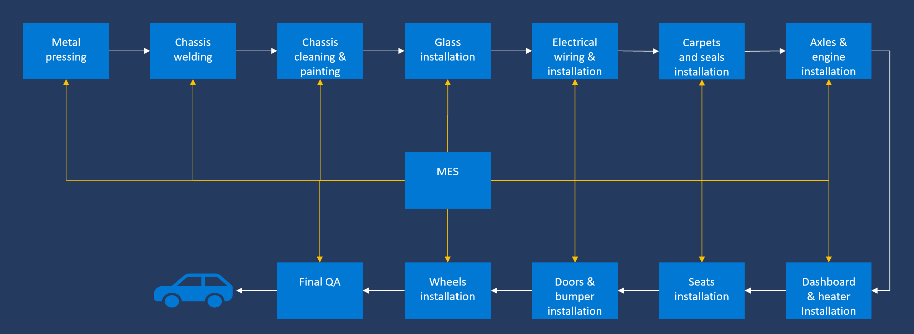
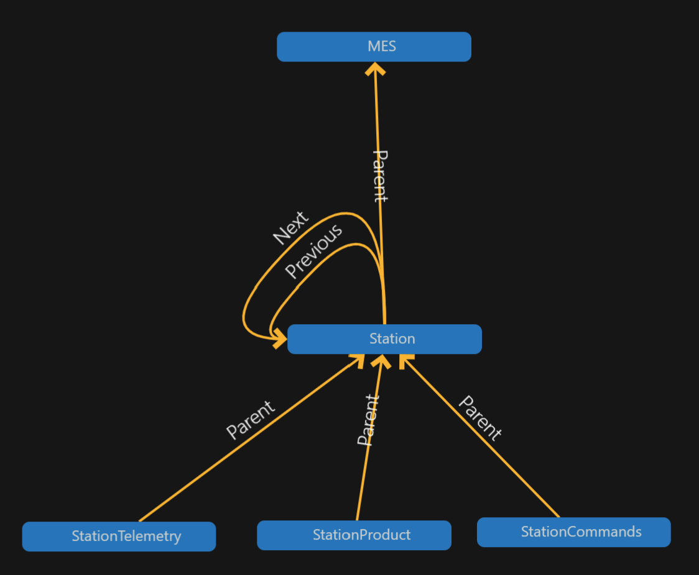
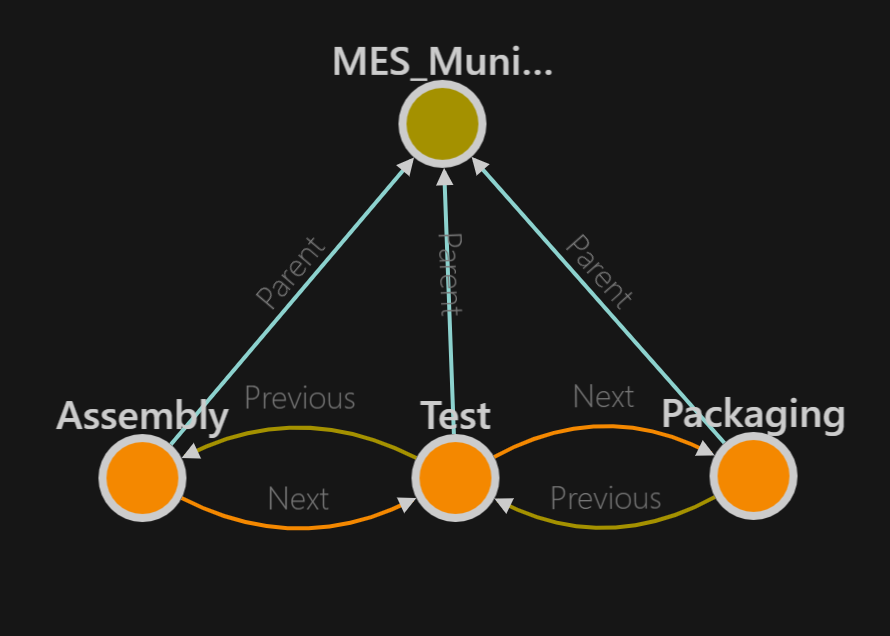

# Manufacturing Ontologies

## Digital Twin Definition Language

These ontologoes leverage the Digital Twin Definition Language (DTDL), which is specified [here](https://github.com/Azure/opendigitaltwins-dtdl/blob/master/DTDL/v2/dtdlv2.md).

### Production Line Layout

A typical production line is organized into a number of inter-connected stations that a product being manufactured has to pass through. The production line layout for this ontology is as follows (MES stands for Manufacturing Execution System):

### Model Relationships

The relationships between the models used in this ontology are described via the following diagram (taken from the [Azure Digital Twins Explorer](https://explorer.digitaltwins.azure.net/) tool):

### Machine Information Model

The underlying machine information model is based on OPC UA and can be used for Overall Equipment Effectiveness (OEE) calculation. It is defined [here](https://github.com/digitaltwinconsortium/ManufacturingDTDLOntologies/blob/main/FactorySimulation/Station/Station.NodeSet2.xml) and is also available in the UA Cloud Library [here](https://uacloudlibrary.opcfoundation.org/).

### Automotive Digital Twin Graph

The digital twin graph for an automotive production line is depicted below (taken from the [Azure Digital Twins Explorer](https://explorer.digitaltwins.azure.net/) tool):

## Production Line Simulation

This repository also contains a production line simulation made up of several Stations, leveraging the machine information model described above, as well as a simple Manufacturing Execution System (MES). Both the Stations and the MES are containerized for easy deployment.

### Simulation Digital Twin Graph

The digital twin graph for the simulated production line is depicted below (taken from the [Azure Digital Twins Explorer](https://explorer.digitaltwins.azure.net/) tool):

### Architecture

### Installation Instructions

To install the production line simulation, you need a Windows PC or virtual machine with at least *16GB of memory* as you will be deploying 30 Docker Containers. You will also need an Azure subscription you have admin access to or get a free Azure subscription from [here](https://azure.microsoft.com/en-us/free).

Follow these steps:

1. Deploy *4 units* of an S1 Azure IoT Hub into your Azure subscription. Once deployed, create 6 devices and call them publisher.munich.corp.contoso, publisher.capetown.corp.contoso, publisher.mumbai.corp.contoso, publisher.seattle.corp.contoso, publisher.beijing.corp.contoso and publisher.rio.corp.contoso.

2. Download and install Docker Desktop from [here](https://www.docker.com/products/docker-desktop), including the Windows Subsystem for Linux (WSL) integration. After installation and a required system restart, accept the license terms and install the WSL2 Linux kernel by following the instructions. Then verify that Docker Desktop is running in the Windows System Tray and enable Kubernetes in Settings.

3. Browse to [here](https://github.com/digitaltwinconsortium/ManufacturingOntologies) and select Code -> Download Zip. Unzip the contents to a directory of your choice.

4. Navigate to the OnPremAssets directory of the Zip you just downloaded and edit the settings.json file for each publisher directory located in the Config directory. Replace [myiothub] with the name of your IoT Hub and replace [publisherkey] with the primary key of the 6 IoT Hub publisher devices you have created earlier. This data can be accessed by clicking on the names of the devices in the Azure Portal.

5. Run the StartSimulation.cmd script from the OnPremAssets folder in a cmd prompt window. This will run the simulation. A total of 8 production lines will be started, each with 3 stations each (assembly, test and packaging) as well as an MES per line and a UA Cloud Publisher instance per factory location. There are 6 locations in total: Munich, Capetown, Mumbai, Seattle, Beijing and Rio. Then check your IoT Hub in the Azure Portal to verify that OPC UA telemetry is flowing to the cloud.

Please note: If you update your Docker Desktop runtime environment, you will need to stop and restart the simulation!

### Next Steps

If you want to store the OPC UA PubSub telemetry data in a time-series database and do further analysis on it, you can deploy an instance of Azure Data Explorer (ADX) from the Azure Portal and connect it directly to your IoT Hub by following the steps in the lower half of the article from [here](https://www.linkedin.com/pulse/using-azure-data-explorer-opc-ua-erich-barnstedt/). Then, import the Station nodeset file into your ADX instance, using the UA Cloud Nodeset Viewer tool also located in the Digital Twin Consortium's GitHub [here](https://github.com/digitaltwinconsortium/UANodesetWebViewer). Once you do that, you can e.g. calculate the OEE using the ADX queries found [here](https://github.com/digitaltwinconsortium/ManufacturingDTDLOntologies/tree/main/ADXQueries).

Also, if you want to test a "digital feedback loop", i.e. triggering a command on one of the OPC UA servers in the simulation from the cloud, based on a time-series reaching a certain threshold (the simulated pressure), then configure and run the StartUACloudCommander.bat file and deploy the PressureRelief Azure Function in your Azure subscription and create an application registration for your ADX instance as described [here](https://docs.microsoft.com/en-us/azure/data-explorer/provision-azure-ad-app). You also need to define the following environment variables in the Azure portal for the Function:
* ADX_INSTANCE_URL
* ADX_DB_NAME
* AAD_TENANT_ID
* APPLICATION_KEY
* APPLICATION_ID
* IOT_HUB_NAME
* IOT_HUB_KEY
* UACOMMANDER_NAME
* UA_SERVER_ENDPOINT
* UA_SERVER_METHOD_ID
* UA_SERVER_OBJECT_ID
* UA_SERVER_DNS_NAME

### Overall Equipment Effectiveness (OEE) Calculation

OEE is a common metric in production environments, see the reference calculation [here](https://www.oee.com/calculating-oee). In the simulation, OEE is calculated on a continous basis and the MES is continously running, i.e. there are no planned stopages in the production. This can be changed by introducing shift times and starting and stopping the MES at the beginning and at the end of a shift. The shift times can also be imported into ADX via one-click ingestion (for example in Excel format) and the OEE calculation functions updated with this data, see [here](https://docs.microsoft.com/en-us/azure/data-explorer/ingest-data-one-click).

### Default Simulation Configuration

The simulation is configured to include 8 production lines by default and the configuration can be altered in the StartSimulation.cmd script. The default configuration is depicted below:

| Production Line | Ideal Cycle Time (in seconds) |
|:---------------:|:-----------------------------:|
| Munich | 6 |
| Capetown | 8 |
| Mumbai | 11 |
| Seattle |	6 |
| Beijing 1	| 9 |
| Beijing 2	| 8 |
| Beijing 3	| 4 |
| Rio |	10 |

### OPC UA Node IDs of Station OPC UA Server

The following OPC UA Node IDs are used in the Station OPC UA Server for telemetry to the cloud
* i=379 - manufactured product serial number
* i=385 - number of manufactured products
* i=391 - number of discarded products
* i=398 - running time
* i=399 - faulty time
* i=400 - status (0=station ready to do work, 1=work in progress, 2=work done and good part manufactured, 3=work done and scrap manufactured, 4=station in fault state)
* i=406 - energy consumption
* i=412 - ideal cycle time
* i=418 - actual cycle time
* i=434 - pressure

## License

This work is licensed under a <a rel="license" href="http://creativecommons.org/licenses/by/4.0/">Creative Commons Attribution 4.0 International License</a>.
