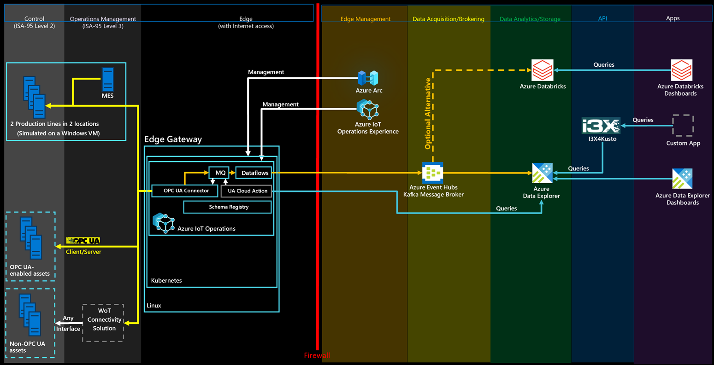

# Manufacturing Ontologies

## Introduction

An ontology defines the language used to describe a system. In the manufacturing domain, these systems can represent a factory or plant but also enterprise applications or supply chains. There are several established ontologies in the manufacturing domain. Most of them have long been standardized. In this repository, we have focused on ISA95 to describe a factory ontology. The ontologies are available [here](https://github.com/digitaltwinconsortium/ManufacturingOntologies/tree/main/Ontologies).

> [!NOTE]
> This article is the **Microsoft OPC UA Reference Solution**, which uses **IEC 62541 standard OPC UA PubSub** to send telemetry data from the edge to the cloud. It is **different** from the default telemetry configuration of Azure IoT Operations, which also caters for scenarions where no OPC UA-enabled telemetry sources are involved, i.e. OPC UA PubSub is **not required** between Azure IoT Operations and cloud endpoints. The Azure IoT Operations architecture is described at [**Azure IoT Operations Overview**](https://learn.microsoft.com/en-us/azure/iot-operations/overview-iot-operations#architecture-overview).

## OPC UA Reference Solution

Manufacturers want to use an industrial IoT solution that doesn't lock them in to walled-garden ecosystems. In addition, they want to deploy this solution on a global scale and connect all of their production sites to it to increase efficiencies for each individual site.

These increased efficiencies lead to faster production, better quality and lower energy consumption, which all lead to lowering the cost for the produced goods.

The solution must be as efficient as possible and enable all required use cases such as condition monitoring, overall equipment effectiveness (OEE) calculation, forecasting, and anomaly detection. By using the insights gained from these use cases, manufacturers can then create digital feedback loops, which can apply optimizations and other changes to the production processes fully automatically.

Interoperability is the key enabler for these requirements. The use of open standards such as OPC UA significantly helps to achieve this interoperability, which lead to the establishment of the [OPC Foundation Cloud Initiative](https://opcfoundation.org/cloud). This OPC UA Reference Solution is Microsoft's implementation of the Cloud Initiative's reference architecture.



The following articles describe how to deploy this reference solution as well as how to connect it to various Microsoft services:

- [Connect Azure Data Explorer to the reference solution](adx.md) describes the end-to-end industrial IoT reference solution that uses Azure Data Explorer to store and analyze OPC UA telemetry for use cases such as condition monitoring, OEE calculation, and anomaly detection.
- [Connect Azure Databricks to the reference solution](databricks.md) walks through storing and analyzing OPC UA PubSub telemetry in Azure Databricks using Delta Lake tables and Structured Streaming ingestion from Azure Event Hubs.
- [Connect Microsoft Fabric to the reference solution](fabric.md) explains how to ingest and process the reference solution's OPC UA PubSub data in a Microsoft Fabric Eventhouse for Real-Time Intelligence, mirroring the same tables, functions, and views used by Azure Data Explorer.
- [Connect Microsoft Power BI to the reference solution](powerbi.md) describes how to connect Microsoft Power BI to the reference solution's OPC UA PubSub data.
- [Connect Azure Managed Grafana to the reference solution](grafana.md) describes how to connect Azure Managed Grafana to the reference solution's OPC UA PubSub data.
- [Connect Microsoft Dynamics 365 Field Service to the reference solution](fieldservice.md) describes how to connect Microsoft Dynamics 365 Field Service to the reference solution's OPC UA PubSub data.
- [Connect SAP to the reference solution](https://learn.microsoft.com/en-us/azure/architecture/guide/iot/howto-connect-on-premises-sap-to-azure) describes how to connect SAP to the reference solution.
- [Connect an industrial data space to the reference solution](https://learn.microsoft.com/en-us/azure/architecture/guide/iot/howto-iot-industrial-dataspaces) describes how to connect an industrial data space to the reference solution.
- [Import OPC UA Information Models from the UA Cloud Library into Azure services](cloudlib.md) describes how to import standardized OPC UA information models from the OPC Foundation's UA Cloud Library into Azure services.

## Production line simulation

The production line simulation is made up of several stations, using the station OPC UA information model, and a simple manufacturing execution system (MES). Both the stations and the MES are containerized for easy deployment. Their configuration is:

| Production Line | Ideal Cycle Time (in seconds) |
| --- | --- |
| Munich | 6 |
| Seattle | 10 |

| Shift Name | Start | End |
| --- | --- | --- |
| Morning | 07:00 | 14:00 |
| Afternoon | 15:00 | 22:00 |
| Night | 23:00 | 06:00 |

Shift times are in local time zone of Seattle and Munich. There are 1 hour breaks between shifts.

The station OPC UA server uses the following OPC UA node IDs for telemetry to the cloud:

- `i=379` - manufactured product serial number
- `i=385` - number of manufactured products
- `i=391` - number of discarded products
- `i=398` - running time
- `i=399` - faulty time
- `i=400` - status (0=station ready to do work, 1=work in progress, 2=work done and good part manufactured, 3=work done and scrap manufactured, 4=station in fault state)
- `i=406` - energy consumption
- `i=412` - ideal cycle time
- `i=418` - actual cycle time
- `i=434` - pressure

The solution uses a digital feedback loop to manage the pressure in a simulated station. To implement the feedback loop, the solution triggers a command from the cloud on one of the OPC UA servers in the simulation. The trigger activates when simulated time-series pressure data reaches a certain threshold. You can see the pressure of the assembly machine in the Azure Data Explorer dashboard. The pressure is released at regular intervals for the Seattle production line. In a real-world deployment, something as critical as opening a pressure relief valve would be done on-premises. This example simply demonstrates how to achieve the digital feedback loop.

## Azure IoT Operations configuration for OPC UA PubSub

The ADX update policies that expand the raw data (`OPCUATelemetryExpand` and `OPCUAMetaDataExpand`, created by the deployment) read the dataset identity and timestamp **from the message body**. They expect each event hub message to be an OPC UA PubSub DataSet message shaped like this:

```json
{
  "DataSetWriterId": "<dataset / writer id>",
  "Timestamp": "2024-01-01T00:00:00Z",
  "Payload": { "<FieldName>": { "Value": "<value>" } }
}
```

(metadata messages carry a `MetaData` object instead of `Payload`). With Azure IoT Operations, the identity instead arrives in the CloudEvent attributes (`subject`, `time`) as `ce-`/MQTT user properties, so it is missing from the body. The steps below add a data flow `map` transform that copies those attributes into the body, so ADX - and the identical logic on Fabric and Databricks - keeps working unchanged.

1. **Keep the CloudEvent attributes available to the data flow.** On the endpoints this flow uses (the local MQTT broker source and the Event Hubs/Kafka destination), set `cloudEventAttributes` to `Propagate` so `subject`, `time`, and the other attributes survive as message metadata. For the MQTT source endpoint:

   ```json
   {
     "endpointType": "Mqtt",
     "mqttSettings": {
       "host": "aio-broker:18883",
       "cloudEventAttributes": "Propagate"
     }
   }
   ```

   The Event Hubs (Kafka) destination endpoint takes the same `"cloudEventAttributes": "Propagate"` under `kafkaSettings`. See the advanced settings for the [MQTT](https://learn.microsoft.com/azure/iot-operations/connect-to-cloud/howto-configure-mqtt-endpoint#advanced-settings) and [Kafka / Event Hubs](https://learn.microsoft.com/azure/iot-operations/connect-to-cloud/howto-configure-kafka-endpoint#advanced-settings) endpoints.

2. **Create the data flow.** Create a data flow whose source is the AIO MQTT broker topic carrying the OPC UA telemetry and whose destination is the `data` event hub (and a second, identical flow for the `metadata` event hub). Every data flow must use the local MQTT broker endpoint as its source or destination. You can use the [operations experience](https://iotoperations.azure.com/) visual editor, `az iot ops dataflow apply --config-file <file>.json`, or Bicep - see [Create data flows](https://learn.microsoft.com/azure/iot-operations/connect-to-cloud/howto-create-dataflow).

3. **Add the map transform.** Add a `BuiltInTransformation` operation between the source and destination. The first rule wraps every incoming dataset value field under `Payload`; the next two copy the CloudEvent identity and timestamp from the message metadata into the body:

   ```json
   {
     "operationType": "BuiltInTransformation",
     "builtInTransformationSettings": {
       "map": [
         {
           "inputs": ["*"],
           "output": "Payload.*",
           "description": "Wrap all dataset value fields under Payload"
         },
         {
           "inputs": ["$metadata.user_properties.subject"],
           "output": "DataSetWriterId",
           "description": "CloudEvent subject -> dataset identity"
         },
         {
           "inputs": ["$metadata.user_properties.time"],
           "output": "Timestamp",
           "description": "CloudEvent time -> Timestamp"
         }
       ]
     }
   }
   ```

   Notes:
   - The wildcard rule must be the **first** rule and only one is allowed per map. `"inputs": ["*"]` with `"output": "Payload.*"` nests all top-level fields under `Payload` - see the [map transform](https://learn.microsoft.com/azure/iot-operations/connect-to-cloud/howto-dataflow-graphs-map) and the [expressions reference](https://learn.microsoft.com/azure/iot-operations/connect-to-cloud/concept-dataflow-graphs-expressions#wildcards).
   - `$metadata.user_properties.<attribute>` reads a CloudEvent attribute (an MQTT user property). In the operations experience editor, enter it with a leading `@`, for example `@$metadata.user_properties.subject`. Adjust the path to match how your endpoint surfaces the attribute (a bare `subject` user property on MQTT, or a `ce-subject` header on Kafka / Event Hubs).
   - The expansion reads `Payload.<Field>.Value`, so each value must be an object with a `Value` member (the native OPC UA dataset shape). If your connector emits flat values, add a per-field rule (or an expression) that wraps each as `{ "Value": ... }`.

4. **Repeat for metadata.** In the metadata flow, wrap the incoming metadata under `MetaData` (`"output": "MetaData.*"`) and set the same `DataSetWriterId`/`Timestamp`. Shape the `MetaData` object to match `OPCUAMetaDataExpand` - a `Name`, a `ConfigurationVersion` with `MajorVersion`/`MinorVersion`, and a `Fields` array - as defined by the `OPCUA-parsing-script` in [Deployment/arm.json](Deployment/arm.json).

After the transform, each event hub message carries the `DataSetWriterId`, `Timestamp`, and `Payload`/`MetaData` the update policy expects, so the existing ADX expansion - and the identical logic on Fabric and Databricks - works without change.

## W3C Web of Things

The ontologies defined in this repository are described by leveraging the W3C Web of Things (WoT), which is specified [here](https://www.w3.org/TR/wot-thing-description/). They were generated by an open-source DTDL-WoT conversion tool available [here](https://github.com/web-of-things-open-source/wot-dtdl-converter). A comparison between DTDL and WoT and how the two specs interoperate is described [here](https://github.com/digitaltwinconsortium/ManufacturingOntologies/blob/master/comparison.md).

## International Society of Automation 95 (ISA95/IEC 62264)

ISA95 / IEC 62264 is the manufacturing ontology leveraged by this solution. It is a standard and described [here](https://en.wikipedia.org/wiki/ANSI/ISA-95) and [here](https://en.wikipedia.org/wiki/IEC_62264). The OPC UA Companion Specification for it is available [here](https://github.com/OPCFoundation/UA-Nodeset/tree/latest/ISA-95) and [here](https://github.com/OPCFoundation/UA-Nodeset/tree/latest/ISA95-JOBCONTROL).

## License

<a rel="license" href="http://creativecommons.org/licenses/by/4.0/"></a>

This work is licensed under a <a rel="license" href="http://creativecommons.org/licenses/by/4.0/">Creative Commons Attribution 4.0 International License</a>.
