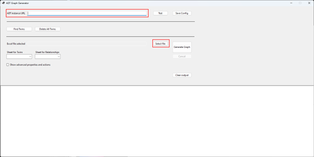
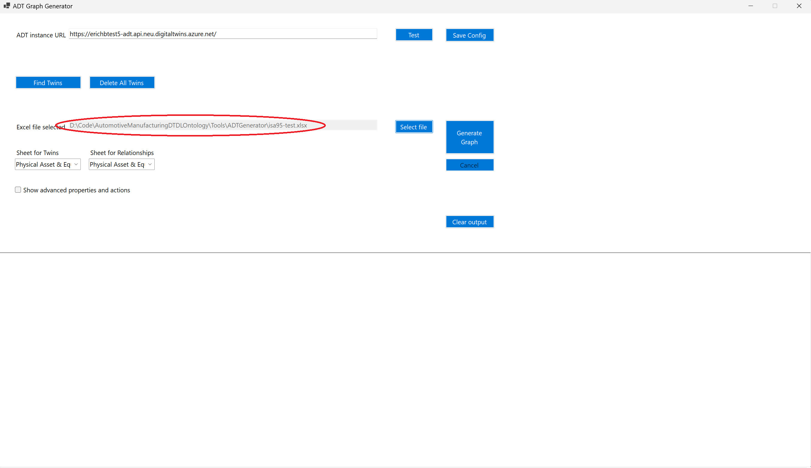
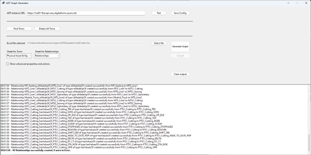
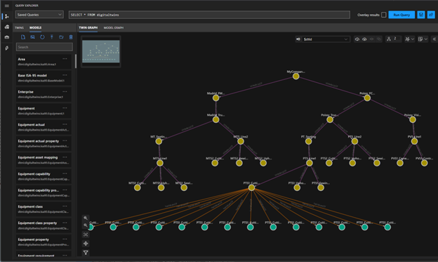
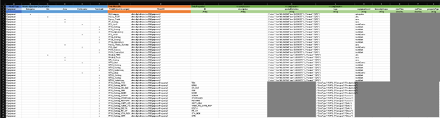

## ADT Generation tool for ISA95

### Overview

We provided a tool that can load an Excel file to simplify the creation of a digital twin graph in Azure Digital Twins service leveraging the ISA95 ontology. The source code of the app can be easily integrated into a console app, should you want to make this tool part of an end-to-end DevOps pipeline.

### The main components of the tool

- MainForm contains the UI and main logic of the application
- ADTHelper centralizes API calls to ADT
- JSONHelper parses the configuration file
- Isa95-test.xlsx is the Excel file to start with a first ISA95 digital twin graph

### Getting started

1. Navigate to the `./Tools/ADTGenerator/binaries` directory of the extracted repository and run 'ADTGenerator`.

1. Provide the URL of your ADT instance, then select `Test`, to validate the URL.

Note: Select `Save Config` to persist the URL of your ADT instance.

1. Load the Excel file (use the isa95-test.xlsx provided with the tool to get started).
1. Before starting the graph generation, you must select the Excel worksheets you are going to use for ADT digital twins and relationships generation. In our case we will select `Physical Asset & Equipment` and `Relationships`.
1. Select `Generate Graph` to process your Excel document. This will generate the digital twins and relationships in your ADT instance.

1. Open ADT Explorer for your ADT instance, you should see a digital twin graph similar to this:

### Adding digital twins

You can add columns to the Excel file to add additional digital twins.

We recommend creating different worksheets (one for assets, one for process definition, etc.) to reduce the combination of columns to fill in. 

Select one worksheet at the time to generate the graph as explained in the Getting started section.

Check the `Show advanced properties and action` box to display indicies used by the tool:

- `First Metadata column` is the index of the first column used in the digital twins worksheet to generate twins. You can create as many columns as you need. It's important that the `First Metadata column` and the following column the following is keept in place:
  - TwinID
  - ModelID
	
- `First Property column` is the index of the first column used in the digital twins worksheet to set all the properties relevant for your digital twins. The tool expects to find, for each property, the property name in row 2, the property type in row 3 and the value of the property in each row.

There are different technical sheets to simplify data preparation:

`Components & Properties` is a direct projection of the ISA95 ontology, containing, for each model:

- The category (PhysicalAssetAndEquipment, Material, OperationsDefinition, etc.)
- The Short model name (Equipment, JobOrder, etc.)
- The model ID (dtmi:digitaltwins:isa95:Equipment;1)
- The components included in the model (mandatory information to create twins)
- 'x' value in columns associated with properties declared in the model

`UI` is the sheet used for data validation in the rest of the document.

`Physical Asset & Equipment` is a good starting point to extend what you already generated in the Getting started section:

- Columns A to F are used to simplify the hierarchy of twins related to the model structure (Equipment). You can modify these columns to fit your needs.
- Column G is for the TwinID
- In column H specifies the twin model (from the UI sheet)
- The tool uses the 'x' information set in the `Components & Properties` sheet to apply conditional formatting from columns I to the end (depending on properties relevant for the models). If the cell is greyed-out, don't enter a value.

