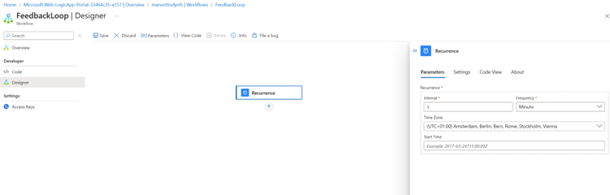
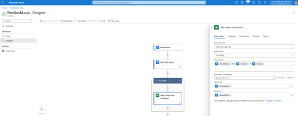

# Configure Dynamics 365 Field Service

This integration showcases the following scenarios:

- Uploading assets from the Manufacturing Ontologies reference solution to Dynamics 365 Field Service.
- Create alerts in Dynamics 365 Field Service when a certain threshold on Manufacturing Ontologies reference solution telemetry data is reached.

The integration leverages Azure Logics Apps. With Logic Apps bussiness-critcal apps and services can be connected via no-code workflows. We will fetch information from Azure Data Explorer and trigger actions in Dynamics 365 Field Service.

## Setup

First, if you are not already a Dynamics 365 Field Service customer, activate a 30 day trial [here](https://dynamics.microsoft.com/en-us/field-service/field-service-management-software/free-trial). Remember is to use the same Azure Entra ID (formerly Azure Active Directory) used while deploying the Manufacturing Ontologies reference solution. Otherwise, you would need to configure cross tenant authentication which is not part of these instructions!

### Create an Azure Logic App to create assets in Dynamics 365 Field Service

Let's start with uploading assets from the Manufacturing Ontologies into Dynamics 365 Field Service:

1; Go to the Azure Portal and create a new Logic App as shown below:


2; Give the Azure Logic App a name, place it in the same resource group as the Manufacturing Ontologies reference solution.


3; Click on 'Workflows':


4; Give your workflow a name - for this scenario we will use the stateful state type, because assets are not flows of data.


5; Create a new trigger. We will start with creating a 'Recurrence' tigger. This will check the database every day if new assets are created. Of course, you can change this to happen more often.



6; In actions, search for 'Azure Data Explorer' and select the 'Run KQL query' command. Within this query we will check what kind of assets we have. Use the following query to get assets and paste it in the query field:

```TEXT
let ADTInstance =  "PLACE YOUR ADT URL";let ADTQuery = "SELECT T.OPCUAApplicationURI as AssetName, T.$metadata.OPCUAApplicationURI.lastUpdateTime as UpdateTime FROM DIGITALTWINS T WHERE IS_OF_MODEL(T , 'dtmi:digitaltwins:opcua:nodeset;1') AND T.$metadata.OPCUAApplicationURI.lastUpdateTime > 'PLACE DATE'";evaluate azure_digital_twins_query_request(ADTInstance, ADTQuery)
```


7; To get your asset data into Dynamics 365 Field Service, you need to connect to Microsoft Dataverse. Connect to your Dynamics 365 Field Service instance and use the following configuration:

- Use the 'Customer Assets' Table Name
- Put the 'AssetName' into the Name field


8; Save your workflow and run it. You will see in a few seconds later that new assets are created in Dynamics 365 Field Service.


### Create Azure Logic App to create Alerts in Dynamics 365 Field Service

This workflow will create alerts in Dynamics 365 Field Service, specifically when a certain threshold of FaultyTime on an asset of the Manufacturing Ontologies reference solution is reached.

1; We first need to create an Azure Data Explorer function to get the right data. Go to your Azure Data Explorer query panel in the Azure Portal and run the following code to create a FaultyFieldAssets function:


```TEXT
.create-or-alter function  FaultyFieldAssets() {  
let Lw_start = ago(3d);
opcua_telemetry
| where Name == 'FaultyTime'
and Value > 0
and Timestamp between (Lw_start .. now())
| join kind=inner (
    opcua_metadata
    | extend AssetList =split (Name, ';')
    | extend AssetName=AssetList[0]
    ) on DataSetWriterID
| project AssetName, Name, Value, Timestamp}
```

2; Create a new workflow in Azure Logic App. Create a 'Recurrance' trigger to start - every 3 minutes. Create as action 'Azure Data Explorer' and select the Run KQL Query.


3; Enter your Azure Data Explorer Cluster URL, then select your database and use the function name created in step 1 as the query.


4; Select Microsoft Dataverse as action and put the below configuration in the fields:



5; Run the workflow and to see new alerts being generated in your Dynamics 365 Field Service dashboard:


