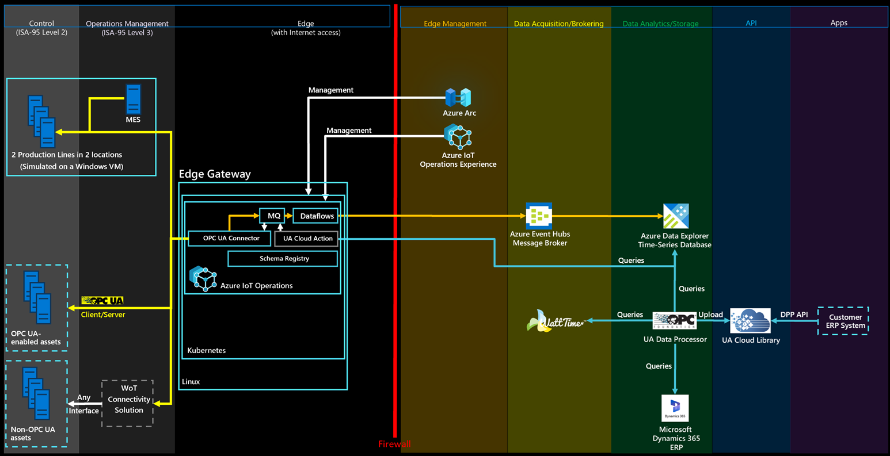

# Enable an industrial dataspace on Azure

Many manufacturers need to provide data about their manufactured products to their customers in digital and machine-readable from. Sometimes a law such as the European Commission's [Digital Product Passport](https://data.europa.eu/news-events/news/eus-digital-product-passport-advancing-transparency-and-sustainability) legislation mandates this requirement. To provide this data, manufacturers often create an industrial dataspace between their enterprise systems and their customer's systems. The dataspace provides a secure, point-to-point communication channel for digital product data between the manufacturer and the customer.

## What is an industrial dataspace?

An industrial dataspace is a virtual environment designed to facilitate the secure and efficient exchange of data between different organizations within an industrial ecosystem, such as those developed by [International Data Spaces Association](https://internationaldataspaces.org/why/data-spaces). An industrial dataspace focuses on the following key principles:

- **Data sovereignty**: It ensures that data providers retain control over their data, including who can access it and under what conditions.
- **Interoperability**: It uses standardized protocols and governance models to enable seamless data sharing across various platforms and industries.
- **Collaboration**: It supports collaborative efforts by allowing different stakeholders to share and utilize data for mutual benefit.

These principles are relevant in the context of *Industry 4.0*, where interconnected systems and data-driven decision-making are crucial for optimizing industrial processes and creating resilient supply chains.

The following diagram shows an overview of the solution:

All the required components to enable the industrial dataspace are deployed to Azure during the Azure Data Explorer workflow.

## Industrial dataspace use case: Provide a carbon footprint for your produced products via the Digital Product Passport

Providing the Product Carbon Footprint (PCF) is one of the most popular use cases for industrial dataspaces. It's increasingly important in the buying decision for customers. Products with a low PCF are popular, but accurately calculating the PCF is hard. The [Green-House Gas (GHG) Protocol](https://ghgprotocol.org) is a common calculation method for the PCF. It splits up the calculation task into scope 1, scope 2, and scope 3 emissions. This example and reference solution focuses on calculating scope 2 emissions from the simulated production lines. Scope 2 emissions are the emissions produced during a production process. The simulated stations along the production lines provide energy consumption data. This data is used to calculate the scope 2 carbon footprint for each produced product, if the *marginal carbon intensity* of the electrical energy consumed is known for the location of the simulated production lines. This information is optionally retrieved from a non-Microsoft cloud service operated by [WattTime](https://watttime.org). If the WattTime service isn't configured, the calculation uses an average value.

## IEC 62541 Open Platform Communication Unified Architecture (OPC UA)

This reference solution supports Digital Product Passport (DPP) data modeling in a machine-readable and standardized fashion with [OPC UA](https://opcfoundation.org/about/opc-technologies/opc-ua). This approach is aligned with the new OPC Foundation [Cloud Initiative](https://opcfoundation.org/cloud) and simplifies modeling because it taps into the large OPC UA ecosystem. You can use any OPC UA modeling tool such as the [Siemens OPC UA Modeling Editor (SiOME)](https://support.industry.siemens.com/cs/document/109755133/siemens-opc-ua-modeling-editor-%28siome%29?dti=0&amp;lc=en-US) or the [CESMII Smart Manufacturing Profile Designer](https://profiledesigner.cesmii.net) with the reference solution. The reference solution also uses the OPC UA [Nodeset](https://opcconnect.opcfoundation.org/2017/04/using-nodeset-files-to-exchange-information) file format and the new OpenAPI-compatible [OPC UA REST interface](https://reference.opcfoundation.org/Core/Part6/v105/docs/G.3).

This example automatically creates a Product Caron Footprint (PCF) for a sample of the simulated products produced and stores the DPPs in an UA Cloud Library. The UA Cloud Library is provided as an open-source reference solution by the [OPC Foundation](https://www.opcfoundation.org). The configuration of the deployed UA Cloud Library happens automatically during the deployment workflow and comes with its own dashboard. To access the dashboard, navigate to the **Overview** page of the UA Cloud Library container app from the Azure portal, and select the **Application URL** displayed. The UA Cloud Library comes with its own Explorer that can be used to inspect produced DPPs.

> [!NOTE]
> The UA Cloud Library has a REST interface that's [OpenAPI](https://swagger.io/specification) compatible and implements the official Digital Product Passport interface as specified in the EN 18222 standard.

### Optionally, configure the WattTime service

Optionally, to optionally configure the WattTime service for a more accurate carbon footprint calculation:

1. Go to [Register New User](https://docs.watttime.org/#tag/Authentication/operation/post_username_register_post) and choose a username and password for the service. You need these credentials later in this guide.
2. From a Windows command prompt, enter `wsl` to start the Windows Subsystem for Linux. If WSL isn't yet installed on your computer, install it by running `wsl --install` and reboot your computer.
3. To register your user account, enter the following command, making sure you replace `<username>` and `<password>` with the values you chose previously: `curl -L -X POST -d '{"username":"<username>","password":"<password>","email":"john@johnson.com"}' https://api.watttime.org/register --header 'Content-Type: application/json' --header 'Accept: application/json'`.
4. From a web browser, navigate to the [online basic auth header generator](https://www.debugbear.com/basic-auth-header-generator) and enter your username and password. Copy the generated access token.
5. To validate your registration, sign in to the service using the following command, making sure you replace `<YOUR_ACCESS_TOKEN>` with the token from the previous step: `curl -L -X GET https://api.watttime.org/login -H 'Authorization: Basic <YOUR_ACCESS_TOKEN>'`. If the validation succeeds, you get a token as a response.
6. [Contact WattTime](https://watttime.org/contact) to upgrade your free account to a pro account. The free account only gives you access to the CAISO\_North sub-region, but you need access to the location of the simulated production lines in Munich and Seattle.
7. Wait until you receive an email from WattTime that your account was upgraded to a pro account. Then, from the Azure portal, navigate to the Azure Container App instance for the deployed UA Cloud Action. Follow the steps in [Add environment variables on existing container apps](/en-us/azure/container-apps/environment-variables?tabs=portal#add-environment-variables-on-existing-container-apps), navigate to the **Environment variables** section of the **Edit a container** panel, select **Manual entry** for the **Source** field, and enter your WattTime username and password in the **Value** field of the two existing environment variables **WATTTIME\_USER** and **WATTTIME\_PASSWORD**. Select **Save** and then **Create** to deploy a new revision of your UA Cloud Action.
