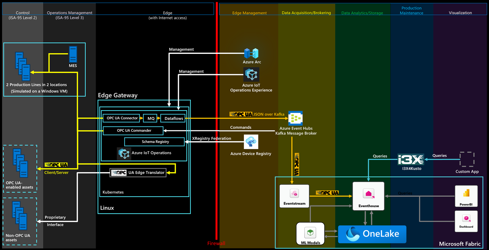

# Connect Microsoft Fabric to the Reference Solution

[Microsoft Fabric](https://learn.microsoft.com/en-us/fabric/get-started/microsoft-fabric-overview) is an all-in-one analytics solution that covers everything from data movement to data science, analytics, and business intelligence. It offers a comprehensive suite of services, including data lake, data engineering, and data integration, all in one place. You don't even need an Azure subscription for it, let alone deploy or manage any apps or services. You can get started with Microsoft Fabric [here](https://learn.microsoft.com/en-us/fabric/get-started/fabric-trial).

## Automated deployment

The reference solution's deployment script can automatically deploy and configure Microsoft Fabric for you, as a **third analytics option** next to Azure Data Explorer and Azure Databricks.

**Prerequisites and notes**
>
> - **Deploy the main solution first.** Fabric reuses the managed identity (`<resourcesName>-Identity`), Event Hubs namespace, Container Apps environment and the `fabric` consumer groups created by the ADX/Databricks deployment. Deploy that first (see [adx.md](adx.md)) and note the `resourcesName` you used, then deploy the Fabric template **into the same resource group**:
> - **Enable Microsoft Fabric for the tenant (required).** Deploying the F2 capacity in Azure does **not** turn Fabric on for your tenant. If `fabric.microsoft.com` keeps switching back to Power BI, a Fabric admin still needs to enable Fabric: **Fabric portal -> Settings (gear) -> Admin portal -> Tenant settings -> Microsoft Fabric -> "Users can create Fabric items" -> On -> Apply** (requires the *Fabric administrator* role; can be scoped to the whole organization or to specific security groups). Alternatively enable it just for this capacity: **Admin portal -> Capacity settings -> select `<resourcesName>fabric` -> Delegate tenant settings -> Microsoft Fabric -> check "Override tenant admin selection" -> enable "Users can create Fabric items" -> Apply.** See [Enable Microsoft Fabric for your organization](https://learn.microsoft.com/fabric/admin/fabric-switch).
> - **Tenant setting (required):** The Fabric setup script calls the Fabric REST APIs as the solution's user-assigned managed identity (`<resourcesName>-Identity`), so a Fabric tenant admin must enable **Service principals can use Fabric APIs** (Fabric admin portal -> Tenant settings -> Developer settings). That setting can only be scoped to **the whole organization** or to **specific security groups** - it can't target an identity by name - so to limit it, create a Microsoft Entra security group, add the managed identity to it, and select that group. Without this, the setup script's Fabric API calls fail with `401`/`403`. Allow a few minutes after changing the tenant setting for it to propagate. (If you deploy Fabric before the setting is in place, the setup step fails with `401`/`403`; fix the setting and redeploy the Fabric template - it is idempotent and reuses any items it already created.)
> - **First time using Fabric? Provision the capacity with the main deployment.** If your tenant has never used Microsoft Fabric, enable **`deployFabricCapacity`** when you deploy the main solution ([adx.md](adx.md)). That creates the `<resourcesName>fabric` capacity up front, so the capacity exists in the Fabric admin portal and a Fabric admin can enable the two tenant settings above (**Users can create Fabric items** and **Service principals can use Fabric APIs**) *before* you run this Fabric template (avoiding the `401`/`403` chicken-and-egg above). The capacity name is identical in both templates, so this is safe: if you set `deployFabricCapacity` in the main deployment, this template reuses that capacity; if you did not, this template provisions it itself.
> - **Capacity administration:** the solution's managed identity (`<resourcesName>-Identity`) is set as the capacity administrator, so the setup script can manage the `<resourcesName>fabric` capacity. To administer it from the Fabric portal as yourself, add your account as a capacity admin afterwards from the Fabric admin portal (Capacity settings -> your capacity -> Admin permissions).

Select the **Deploy to Azure** button and supply the same `resourcesName` you used for the main deployment:

The deployment process prompts you to provide a password for the virtual machine (VM) that hosts the production line simulation and the Edge infrastructure.

To reduce cost, the deployment creates a single Linux VM for both the production line simulation and the edge infrastructure. In a production scenario, the production line simulation isn't required.

The Fabric template provisions:

- a **Microsoft Fabric F-SKU capacity** named `<resourcesName>fabric` (`F2` - the smallest and cheapest SKU), unless you already created it in the main deployment via `deployFabricCapacity`, in which case the existing capacity is reused,
- a deployment script (running as the solution's managed identity) that creates a Fabric workspace (`<resourcesName>-Fabric`) assigned to that capacity, an **Eventhouse** (`opcua`)
- an **I3X (Information Interoperability) API** container app named `<resourcesName>-i3x4kusto-fabric` (the same `ghcr.io/azure-samples/i3x4kusto:main` image used for ADX) that exposes the Eventhouse over the I3X REST API. Its URL is returned as the `i3x4KustoFabricUrl` template output.

## Use the sample dashboard

The reference solution ships a sample **Fabric RTI dashboard** that mirrors the use cases of the Azure Data Explorer dashboard: condition monitoring, OEE calculation, energy consumption, production and diagnostics for the Munich and Seattle production lines. The dashboard is already imported and published against the deployed EventHouse - just open it from **Dashboards** in your workspace. 

## Run a Query

Open your KQL database and select its `opcua_queryset`. Because the telemetry `Subject` is the numeric `DataSetWriterId`, the station and production line are matched on the metadata `DataSetName` (built from the OPC UA server's ApplicationUri and NodeId) and then joined to the telemetry on `Subject`. (With Azure IoT Operations, the station and line usually aren't encoded in `DataSetName`, so point these filters at whatever your asset or dataset naming carries instead.) Delete the sample queries, enter the following query in the text box, and select `Run`:

        let _startTime = ago(1h);
        let _endTime = now();
        opcua_metadata_lkv
        | where DataSetName contains "assembly"
        | where DataSetName contains "munich"
        | join kind=inner (
            opcua_telemetry
            | where Name == "Status"
            | where Timestamp > _startTime and Timestamp < _endTime
        ) on Subject
        | extend energy = todouble(Value)
        | project Timestamp1, energy
        | sort by Timestamp1 desc
        | render linechart
