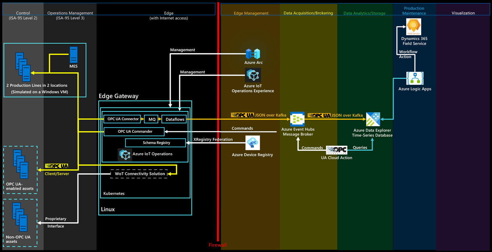

# Connect Microsoft Dynamics 365 Field Service to the Reference Solution



This integration showcases the following scenarios:

- Upload assets from the manufacturing ontologies solution to Dynamics 365 Field Service.
- Create alerts in Dynamics 365 Field Service when a certain threshold on manufacturing ontologies solution telemetry data is reached.

The integration uses Azure Logic Apps. With Logic Apps, you can use no-code workflows to connect business-critcal apps and services. This example shows you how to fetch data from Azure Data Explorer and trigger actions in Dynamics 365 Field Service.

If you're not already a Dynamics 365 Field Service customer, activate a [30 day trial](https://dynamics.microsoft.com/field-service/field-service-management-software/free-trial).

Tip

To avoid the need to configure cross-tenant authentication, use the same Microsoft Entra ID that you used to deploy the manufacturing ontologies solution.

## Create an Azure Logic Apps workflow to create assets in Dynamics 365 Field Service

To upload assets from the manufacturing ontologies solution into Dynamics 365 Field Service:

1. Go to the Azure portal and create a new logic app resource.
2. Give the Azure Logic Apps a name, and place it in the same resource group as the manufacturing ontologies solution.
3. Select **Workflows**.
4. Give your workflow a name. For this scenario, use the stateful state type because assets aren't flows of data.
5. In the workflow designer, select **Add a trigger**. Create a **Recurrence** trigger to run every day. You can change the trigger to occur more frequently.
6. Add an action after the recurrence trigger. In **Add an action**, search for `Azure Data Explorer` and select the **Run KQL query** command. Leave the default authentication **OAuth**. Enter your Azure Data Explorer cluster URL and `ontologies` as the database name. In this query, you check what kind of assets you have. Use the following query to get assets from the manufacturing ontologies solution:

    ```kql
    opcua_telemetry
    | join kind=inner (    
        opcua_metadata
        | distinct Name, DataSetWriterID
        | extend AssetList = split(Name, ';')
        | extend AssetName = tostring(AssetList[0])
    ) on DataSetWriterID
    | project AssetName
    | summarize by AssetName
    ```
7. To get your asset data into Dynamics 365 Field Service, you need to connect to Microsoft Dataverse. In **Add an action**, search for `Dataverse` and select the **Add a new row** command. Leave the default authentication **OAuth**. Connect to your Dynamics 365 Field Service instance and use the following configuration:

    - In the **Table Name** field, select **Customer Assets**
    - In the **Name** field, select **Enter data from a previous step**, and the select **AssetName**.

    [](/en-us/azure/architecture/solution-ideas/media/concepts-iot-industrial-solution-architecture/add-asset-name.png#lightbox)
8. Save your workflow and run it. You can see the new assets are created in Dynamics 365 Field Service:

    [](/en-us/azure/architecture/solution-ideas/media/concepts-iot-industrial-solution-architecture/dynamics-asset-table.png#lightbox)

## Create an Azure Logic Apps workflow to create alerts in Dynamics 365 Field service

This workflow creates alerts in Dynamics 365 Field Service, when the `FaultyTime` for an asset in the manufacturing ontologies solution reaches a threshold.

1. To fetch the data, create an Azure Data Explorer function. In the Azure Data Explorer query panel in the Azure portal, run the following code to create a `FaultyFieldAssets` function in the **ontologies** database:

    ```kql
    .create-or-alter function  FaultyFieldAssets() {  
    let Lw_start = ago(3d);
    opcua_telemetry
    | where Name == 'FaultyTime'
    and Value > 0
    and Timestamp between (Lw_start .. now())
    | join kind=inner (
        opcua_metadata
        | extend AssetList =split (Name, ';')
        | extend AssetName=AssetList[0]
        ) on DataSetWriterID
    | project AssetName, Name, Value, Timestamp}
    ```
2. Create a new stateful workflow in your Logic App.
3. In the workflow designer, create a recurrence trigger that runs every three minutes. Then add an action and select the **Run KQL query** action.
4. Enter your Azure Data Explorer Cluster URL, then enter **ontologies** as the database name and use the `FaultyFieldAssets` function name as the query.
5. To get your asset data into Dynamics 365 Field Service, you need to connect to Microsoft Dataverse. In **Add an action**, search for `Dataverse` and select the **Add a new row** command. Leave the default authentication **OAuth**. Connect to your Dynamics 365 Field Service instance and use the following configuration:

    - In the **Table Name** field, select **IoT Alerts**
    - In the **Description** field, use **Enter data from a previous step**, to build a message "**[AssetName]** has a **[Name]** of **[Value]**". **AssetName**, **Name**, and **Value** are the fields from the previous step.
    - In the **Alert Time** field, select **Enter data from a previous step**, and the select **Timestamp**.
    - In the **Alert Type** field, select **Anomaly**.

    [](/en-us/azure/architecture/solution-ideas/media/concepts-iot-industrial-solution-architecture/add-alert-details.png#lightbox)
6. Run the workflow and to see new alerts generated in your Dynamics 365 Field Service **IoT Alerts** dashboard:

    [](/en-us/azure/architecture/solution-ideas/media/concepts-iot-industrial-solution-architecture/dynamics-iot-alerts.png#lightbox)
