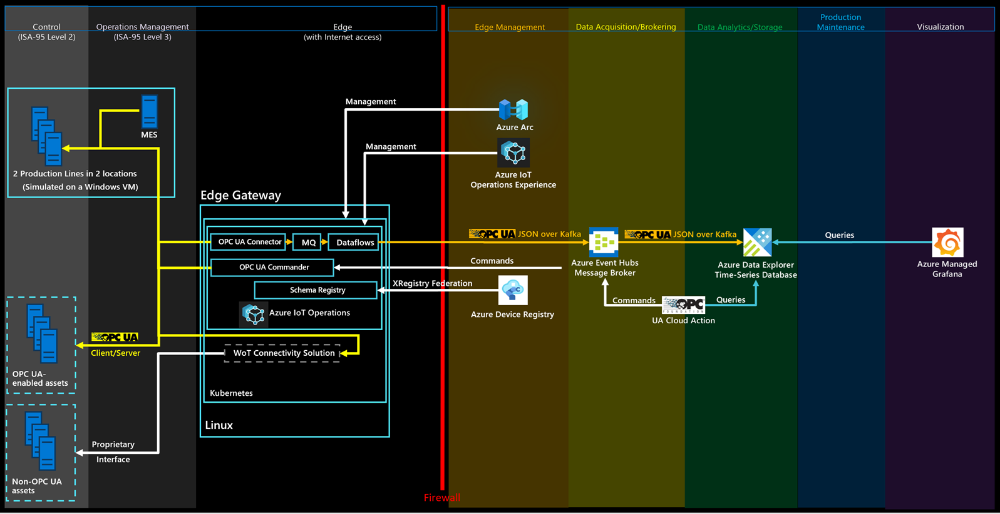

# Connect Azure Managed Grafana to the Reference Solution

You can use Azure Managed Grafana to create a dashboard on Azure for the solution described in this article. Use Grafana within manufacturing to create dashboards that display real-time data. The following steps show you how to enable Grafana on Azure and create a dashboard with the simulated production line data from Azure Data Explorer.



## Enable the Azure Managed Grafana service

To create an Azure Managed Grafana service and configure it with permissions to access the ontologies database:

1. In the Azure portal, search for *Grafana*, and then select the **Azure Managed Grafana** service.
2. To create the service, on **Create Grafana Workspace** enter a name for your instance. Choose all the default options.
3. After the service is created, make sure your Grafana instance has a system assigned managed identity. In the Azure portal, go to the **Identity** blade of your Azure Managed Grafana instance. If the system assigned managed identity isn't enabled, enable it. Make a note of the **Object (principal) ID** value, you need it later.
4. To grant permission for the managed identity to access the ontologies database in Azure Data Explorer:

    1. Go to the **Permissions** blade in your Azure Data Explorer instance in the Azure portal.
    2. Select **Add &gt; AllDatabasesViewer**.
    3. Search for and select the **Object (principal) ID** value you noted previously.

## Add a new data source in Grafana

Add a new data source to connect to Azure Data Explorer. In this sample, use a system assigned managed identity to connect to Azure Data Explorer. To configure the authentication, follow these steps:

To add the data source in Grafana, follow these steps:

1. Go to the endpoint URL for your Grafana instance. You can find the endpoint URL in the Azure Managed Grafana page for your instance in the Azure portal. Then sign in to your Grafana instance.
2. In the Grafana dashboard, select **Connections &gt; Data sources**, and then select **Add new data source**. Scroll down and select **Azure Data Explorer Datasource**.
3. Choose **Managed Identity** as the authentication menu. Then add the URL of your Azure Data Explorer cluster. You can find the URL in the Azure Data Explorer instance menu in the Azure portal under **URI**.
4. Select **Save and test** to verify the datasource connection.

## Import a sample dashboard

Now you're ready to import the sample dashboard.

1. Download the [Sample Grafana Manufacturing Dashboard](https://github.com/digitaltwinconsortium/ManufacturingOntologies/blob/main/Tools/GrafanaDashboard/samplegrafanadashboard.json) dashboard.
2. In the Grafana menu, go to **Dashboards** and then select **New &gt; Import**.
3. Select **Upload dashboard JSON file** and select the *samplegrafanadashboard.json* file that you downloaded previously. Select **Import**.
4. On the **OEE Station** panel, select **Edit** and then select the Azure Data Explorer **Data source** you set up previously. Then select **KQL** in the query panel and add the following query: `print round (CalculateOEEForStation('${Station}', '${Location}', '${CycleTime}', '${__from:date:iso}', '${__to:date:iso}') * 100, 2)`. Select **Apply** to apply your changes and go back to the dashboard.
5. On the **OEE Line** panel, select **Edit** and then select the Azure Data Explorer **Data source** you set up previously. Then select **KQL** in the query panel and add the following query: `print round(CalculateOEEForLine('${Location}', '${CycleTime}', '${__from:date:iso}', '${__to:date:iso}') * 100, 2)`. Select **Apply** to apply your changes and go back to the dashboard.
6. On the **Discarded products** panel, select **Edit** and then select the Azure Data Explorer **Data source** you set up previously. Then select **KQL** in the query panel and add the following query: `opcua_metadata_lkv| where Name contains '${Station}'| where Name contains '${Location}'| join kind=inner (opcua_telemetry| where Name == "NumberOfDiscardedProducts"| where Timestamp > todatetime('${__from:date:iso}') and Timestamp < todatetime('${__to:date:iso}')) on DataSetWriterID| extend numProd = toint(Value)| summarize max(numProd)`. Select **Apply** to apply your changes and go back to the dashboard.
7. On the **Manufactured products** panel, select **Edit** and then select the Azure Data Explorer **Data source** you set up previously. Then select **KQL** in the query panel and add the following query: `opcua_metadata_lkv| where Name contains '${Station}'| where Name contains '${Location}'| join kind=inner (opcua_telemetry| where Name == "NumberOfManufacturedProducts"| where Timestamp > todatetime('${__from:date:iso}') and Timestamp < todatetime('${__to:date:iso}')) on DataSetWriterID| extend numProd = toint(Value)| summarize max(numProd)`. Select **Apply** to apply your changes and go back to the dashboard.
8. On the **Energy Consumption** panel, select **Edit** and then select the Azure Data Explorer **Data source** you set up previously. Then select **KQL** in the query panel and add the following query: `opcua_metadata_lkv| where Name contains '${Station}'| where Name contains '${Location}'| join kind=inner (opcua_telemetry    | where Name == "Pressure"    | where Timestamp > todatetime('${__from:date:iso}') and Timestamp < todatetime('${__to:date:iso}')) on DataSetWriterID| extend energy = todouble(Value)| summarize avg(energy)); print round(toscalar(averageEnergyConsumption) * 1000, 2)`. Select **Apply** to apply your changes and go back to the dashboard.
9. On the **Pressure** panel, select **Edit** and then select the Azure Data Explorer **Data source** you set up previously. Then select **KQL** in the query panel and add the following query: `opcua_metadata_lkv| where Name contains '${Station}'| where Name contains '${Location}'| join kind=inner (opcua_telemetry    | where Name == "Pressure"    | where Timestamp > todatetime('${__from:date:iso}') and Timestamp < todatetime('${__to:date:iso}')) on DataSetWriterID| extend NodeValue = toint(Value)| project Timestamp1, NodeValue`. Select **Apply** to apply your changes and go back to the dashboard.

## Configure alerts

In Grafana, you can also create alerts. In this example, you create a low OEE alert for one of the production lines.

1. In the Grafana menu, go to **Alerting &gt; Alert rules**.
2. Select **New alert rule**.
3. Enter a name for your alert, and select **Azure Data Explorer** as the data source. In the **Define query and alert condition** pane, select **KQL**.
4. In the query field, enter the following query. This example uses the Seattle production line:

    ```kql
    let oee = CalculateOEEForStation("assembly", "seattle", 10000, now(), now(-1h));
    print round(oee * 100, 2)
    ```
5. Select **Set as alert condition**.
6. Scroll down to the **Expressions** section. Delete the **Reduce** expression, you don't need it.
7. For the alert threshold, select **A** as **Input**. Select **IS BELOW** and enter **10**.
8. Scroll down to the **Set evaluation behavior** section. Create a new **Folder** to save your alerts. Create a new **Evaluation group** and specify **2m**.
9. Select the **Save rule and exit** button in the upper right.

In the overview of your alerts, you can now see that an alert is triggered when your OEE is less than 10.
