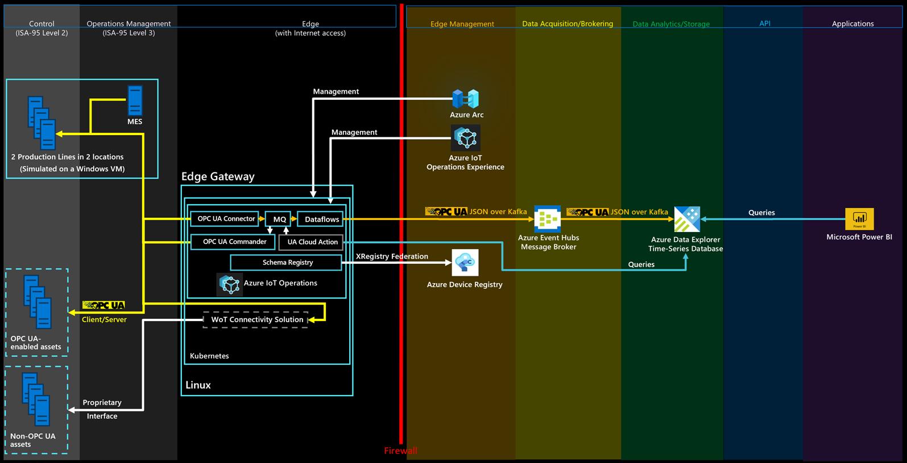

# Connect Microsoft Power BI to the Reference Solution

[Microsoft Power BI](https://learn.microsoft.com/en-us/power-bi/fundamentals/power-bi-overview) is a unified, self-service business intelligence platform that turns data from many sources into interactive, shareable dashboards and reports. For this reference solution it connects to the OPC UA telemetry and lets business users and plant managers explore key manufacturing metrics — such as OEE, production counts, and energy consumption — through rich, drag-and-drop visualizations, without writing queries. With natural-language Q&A, automatic insights, mobile access, and easy sharing across the organization, Power BI makes the industrial data accessible to decision-makers so they can act on it quickly.

To connect the solution Power BI, you need access to a Power BI subscription.



To create the Power BI dashboard, complete the following steps:

1. Install the [Power BI desktop app](https://go.microsoft.com/fwlink/?LinkId=2240819&amp;clcid=0x409).
2. Sign in to the Power BI desktop app using the user with access to the Power BI subscription.
3. In the Azure portal, navigate to your Azure Data Explorer database called ontologies and add **Database Admin** permissions to a Microsoft Entra ID user with access to only the subscription used for your deployed instance of this solution. If necessary, create a new user in Microsoft Entra ID.
4. From Power BI, create a new report and select Azure Data Explorer time-series data as a data source: **Get data &gt; Azure &gt; Azure Data Explorer (Kusto)**.
5. In the popup window, enter the Azure Data Explorer endpoint of your cluster (`https://<your cluster name>.<location>.kusto.windows.net`), the database name (`ontologies`), and the following query:

    ```kql
    let _startTime = ago(1h);
    let _endTime = now();
    opcua_metadata_lkv
    | where Name contains "assembly"
    | where Name contains "munich"
    | join kind=inner (opcua_telemetry
        | where Name == "ActualCycleTime"
        | where Timestamp > _startTime and Timestamp < _endTime
    ) on DataSetWriterID
    | extend NodeValue = todouble(Value)
    | project Timestamp, NodeValue
    ```
6. Sign in to Azure Data Explorer using the Microsoft Entra ID user you gave permission to access the Azure Data Explorer database previously.

    Note

    If the **Timestamp** column contains the same value for all rows, modify the last line of the query as follows: `| project Timestamp1, NodeValue`.
7. Select **Load**. This action imports the actual cycle time of the Assembly station of the Munich production line for the last hour.
8. From the `Table view`, select the **NodeValue** column and select **Don't summarize** in the **Summarization** menu item.
9. Switch to the `Report view`.
10. Under **Visualizations**, select the **Line Chart** visualization.
11. Under **Visualizations**, move the `Timestamp` from the `Data` source to the `X-axis`, select it, and select **Timestamp**.
12. Under **Visualizations**, move the `NodeValue` from the `Data` source to the `Y-axis`, select it, and select **Median**.
13. Save your new report.

Tip

Use the same approach to add other data from Azure Data Explorer to your report.

[](/en-us/azure/architecture/solution-ideas/media/concepts-iot-industrial-solution-architecture/power-bi.png#lightbox)

